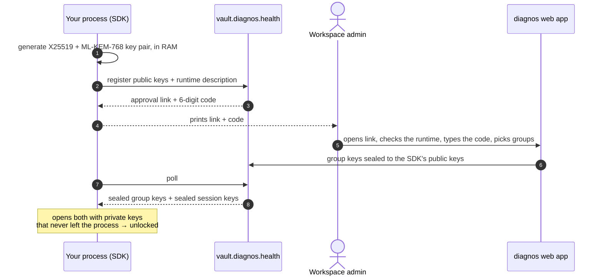
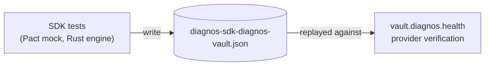

<h1 align="center">diagnos · integration</h1>

<p align="center"><b>Zero-knowledge SDK, CLI and REST API for the diagnos vault.</b></p>

<p align="center">

**English** · [Português (Brasil)](README.pt-BR.md)

</p>

<p align="center">
  <a href="https://github.com/diagnos-tech/integration/actions/workflows/unit-tests.yml?query=branch%3Adevelop"></a>
  <a href="https://github.com/diagnos-tech/integration/actions/workflows/unit-tests.yml?query=branch%3Adevelop"></a>
  <a href="https://github.com/diagnos-tech/integration/actions/workflows/contract-tests.yml?query=branch%3Adevelop"></a>
  <a href="https://github.com/diagnos-tech/integration/actions/workflows/ci.yml?query=branch%3Adevelop"></a>
  <a href="pyproject.toml"></a>
  <a href="LICENSE"></a>
</p>

<p align="center">
  <a href="apps/sdk/README.md"><b>SDK</b></a> ·
  <a href="apps/cli/README.md"><b>CLI</b></a> ·
  <a href="apps/api/README.md"><b>API</b></a> ·
  <a href="docs/PROTOCOL.md">Protocol</a> ·
  <a href="contracts/README.md">Contract tests</a> ·
  <a href="CONTRIBUTING.md">Contributing</a> ·
  <a href="SECURITY.md">Security</a>
</p>

Three open-source Python packages for talking to the diagnos vault without ever handling a signed URL, an HMAC or a
key envelope yourself. Everything clinical is encrypted **inside your process** before it touches the network — the
vault only ever sees ciphertext. These packages make that the *easy* path.

> [!NOTE]
> **Status: 0.1.0 preview.** Every surface — enrollment, sessions, request signing, patients, exams, files and
> folders — speaks the vault's current protocol and is verified against it by the [contract tests](contracts/README.md).
> Known limits, and the questions still open on the vault side, are in [docs/COMPATIBILITY.md](docs/COMPATIBILITY.md).

## Pick your package

| Package | Use it when | Install |
|---|---|---|
| [**`diagnos`**](apps/sdk/README.md) — SDK | Your code is Python. | `pip install diagnos` |
| [**`diagnos-cli`**](apps/cli/README.md) — CLI | Scripts, operations, a quick look. | `pipx install diagnos-cli` |
| [**`diagnos-api`**](apps/api/README.md) — REST API | Your system speaks HTTP, not Python. | [Docker / Kubernetes](apps/api/deploy/README.md) |

Same token, same approval flow, same guarantees. The CLI and the API are thin shells over the SDK — they never
reimplement a single byte of cryptography.

> [!NOTE]
> Not on PyPI yet. Until the first release, install from source (building the SDK needs a
> [Rust toolchain](https://rustup.rs/)):
> `pip install "diagnos @ git+https://github.com/diagnos-tech/integration@develop#subdirectory=apps/sdk"`

## Quick start

**1. Get a token.** Ask a workspace admin for a service-account token:

```sh
export DIAGNOS_API_TOKEN="apikey-…"
```

**2. Enroll.** The first run prints a link and a 6-digit code; an admin approves it in the diagnos web app and picks
which security groups this process may read.

```python
from diagnos import Diagnos

with Diagnos() as vault:  # enrolls on entry: prints the approval link + code
    print(vault.workspace_id)
    print(vault.security_groups)  # the groups the admin granted
```

```sh
diagnos login          # the same enrollment, from the terminal — kept for the next commands
diagnos patients list  # reuses it, no new approval
diagnos logout         # revokes it and wipes the keys
```

**3. Use it.** Patients, exams and files hang off the same object — `vault.patients`, `vault.exams`,
`vault.drives` — see the [SDK guide](apps/sdk/README.md).

One name, three spellings: a **security group** is `security_group=` in the SDK (`security_group_id` on what it
returns), `--group` / `DIAGNOS_GROUP` in the CLI, and `security_group` or `{sg}` in the API.

## How a session is born



Private keys never leave the process, and nothing is written to disk. Stop the process and the next one needs a new
approval — that is the design, not a limitation. For pods and cron jobs, see
[servers without a human](#servers-without-a-human).

## What you get for free

- **🔐 End-to-end by default** — records and files are encrypted in your process; the vault sees ciphertext, signed
  requests and presigned URLs.
- **🛡️ Post-quantum hybrid** — enrollment uses X25519 + ML-KEM-768, so a recorded session stays safe against a future
  quantum adversary.
- **🧱 Keys in a Rust enclave** — `mlock`ed memory, guard pages, excluded from core dumps, zeroed on `fork()` and on
  drop, never handed back to Python as `bytes`. Threat model: [`apps/sdk/native/README.md`](apps/sdk/native/README.md).
- **🔁 Retries and clock skew handled** — idempotent retries, clock sync with the vault, stable exceptions.
- **📐 Pinned byte formats** — [`docs/PROTOCOL.md`](docs/PROTOCOL.md) is normative, and test vectors generated from
  the vault's reference implementation pin every byte.

## Servers without a human

A human approval on every restart is fine for a laptop; it is not fine for a Kubernetes pod. Set two variables and the
SDK saves its unlocked session to [OpenBao](https://openbao.org/)'s encrypted KV right after enrollment, then restores
from there on every start — no human, until the saved session expires.

```sh
pip install "diagnos[openbao]"
export OPENBAO_ADDR="https://openbao.internal:8200"
export OPENBAO_TOKEN="…"   # scoped to one path, nothing wider
```

> [!WARNING]
> This is a deliberate trade: whoever can read that OpenBao path can decrypt exactly what this process can. Read
> [the full trade-off](apps/sdk/README.md#auto-unseal-with-openbao) before turning it on.

Ready-made manifests live in [`apps/api/deploy/`](apps/api/deploy/README.md): Docker Compose and Kubernetes, with OpenBao
auto-unseal for AWS KMS, Azure Key Vault, GCP KMS, Transit, Shamir and static keys.

## Quality gates

Every badge above is a workflow you can run locally with one command.

| Badge | What it proves | Locally |
|---|---|---|
| **Unit tests** | the three packages on CPython 3.11–3.13, plus the Rust enclave | `make test` |
| **Coverage** | combined branch coverage of `diagnos`, `diagnos-cli` and `diagnos-api`, with a floor that only goes up | `make cov` |
| **Contract tests** | the SDK sends and reads exactly what the committed [Pact](https://pact.io) contract says (Rust `pact_ffi` engine) | `make contract` |
| **CI** | lint (Python, Rust, bilingual docstrings, docs), `mypy --strict`, lockfile | `make lint types` |

The contract is consumer-driven: the SDK's tests write
[`contracts/diagnos-sdk-diagnos-vault.json`](contracts/diagnos-sdk-diagnos-vault.json), and the vault verifies that
same file against its real code before it deploys.



## Repository layout

```
integration/
├── apps/
│   ├── sdk/           diagnos          the library — everything lives here
│   │   └── native/    diagnos._secure  Rust memory enclave
│   ├── cli/           diagnos-cli      `diagnos …` in your terminal
│   └── api/           diagnos-api      REST facade (FastAPI), mTLS only
│       └── deploy/    compose · k8s    ready-to-run manifests
├── contracts/         Pact             consumer contract with the vault + its tests
├── docs/              PROTOCOL.md      normative byte formats · COMPATIBILITY.md
└── scripts/                            the checks behind `make lint` and CI
```

## Contributing

You need [uv](https://docs.astral.sh/uv/), Python 3.11–3.13 and, to build the enclave from source,
[Rust](https://rustup.rs/) stable.

```sh
git clone https://github.com/diagnos-tech/integration && cd integration
make sync    # installs everything and builds the Rust enclave
make check   # exactly what CI runs: lint, types, unit and contract tests
make         # lists every other target
```

Read [CONTRIBUTING.md](CONTRIBUTING.md) before your first pull request. Coming from the `imgexam` packages? See
[MIGRATING.md](MIGRATING.md).

## Security

Found a vulnerability? Please **do not** open a public issue — report it privately through
[GitHub Security Advisories](https://github.com/diagnos-tech/integration/security/advisories/new). Details in
[SECURITY.md](SECURITY.md).

<p align="center"><sub><a href="LICENSE">Apache-2.0</a> · <a href="https://diagnos.health">diagnos.health</a></sub></p>
