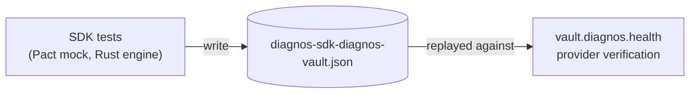

# diagnos · integration

**Zero-knowledge SDK, CLI and REST API for the diagnos vault.**

**English** · [Português (Brasil)](README.pt-BR.md)

[](https://github.com/diagnos-tech/integration/actions/workflows/unit-tests.yml?query=branch%3Adevelop)
[](https://github.com/diagnos-tech/integration/actions/workflows/unit-tests.yml?query=branch%3Adevelop)
[](https://github.com/diagnos-tech/integration/actions/workflows/contract-tests.yml?query=branch%3Adevelop)
[](https://github.com/diagnos-tech/integration/actions/workflows/ci.yml?query=branch%3Adevelop)
[](pyproject.toml)
[](LICENSE)

**[SDK](apps/sdk/README.md)** · **[CLI](apps/cli/README.md)** · **[API](apps/api/README.md)** · [Protocol](docs/PROTOCOL.md) ·
[Contract tests](contracts/README.md) · [Contributing](CONTRIBUTING.md) · [Security](SECURITY.md)

Three open-source Python packages for talking to the diagnos vault without ever handling a signed URL, an HMAC or a
key envelope yourself. Everything clinical is encrypted **inside your process** before it touches the network — the
vault only ever sees ciphertext. These packages make that the *easy* path.

> [!NOTE]
> **Status: 0.1.0 preview.** Every surface — enrollment, sessions, request signing, patients, exams, files and
> folders — speaks the vault's current protocol and is verified against it by the [contract tests](contracts/README.md).
> Known limits, and the questions still open on the vault side, are in [docs/COMPATIBILITY.md](docs/COMPATIBILITY.md).

## Pick your package

| Package | Use it when | Install |
|---|---|---|
| [**`diagnos`**](apps/sdk/README.md) — SDK | Your code is Python. | `pip install diagnos` |
| [**`diagnos-cli`**](apps/cli/README.md) — CLI | Scripts, operations, a quick look. | `pipx install diagnos-cli` |
| [**`diagnos-api`**](apps/api/README.md) — REST API | Your system speaks HTTP, not Python. | [Docker / Kubernetes](apps/api/deploy/README.md) |

Same token, same approval flow, same guarantees. The CLI and the API are thin shells over the SDK — they never
reimplement a single byte of cryptography.

> [!NOTE]
> Not on PyPI yet. Until the first release, install from source — [Install](docs/guides/install.md) has the commands,
> and the [Rust toolchain](https://rustup.rs/) the build needs.

## Quick start

**1. Get a token.** A workspace admin issues a service-account token in the diagnos web app:

```sh
export DIAGNOS_API_TOKEN="apikey-…"
```

**2. Enroll.** The first run prints a link and a 6-digit code; an admin approves it in the web app and picks which
security groups this process may read.

```python
from diagnos import Diagnos

with Diagnos() as vault:  # enrolls on entry: prints the approval link + code
    print(vault.workspace_id)
    print(vault.security_groups)  # the groups the admin granted
```

```sh
diagnos login          # the same enrollment, from the terminal
diagnos status         # token, OpenBao and SDK version
```

**3. Use it.** Patients, exams and files hang off the same object — `vault.patients`, `vault.exams`,
`vault.drives`. The [quickstart](docs/guides/quickstart.md) goes from here to your first encrypted patient and file.

Private keys never leave the process and nothing is written to disk, so the next process needs a new approval — that
is the design, not a limitation. [Authentication](docs/guides/authentication.md) shows the whole enrollment, and
[Sessions](docs/guides/sessions.md#auto-unseal-with-openbao) how servers restart without a human.

## What you get for free

- **🔐 End-to-end by default** — records and files are encrypted in your process; the vault sees ciphertext, signed
  requests and presigned URLs. [Exactly what it sees](docs/guides/security.md#what-the-vault-sees).
- **🛡️ Post-quantum hybrid** — enrollment uses X25519 + ML-KEM-768, so a recorded session stays safe against a future
  quantum adversary.
- **🧱 Keys in a Rust enclave** — `mlock`ed memory, guard pages, excluded from core dumps, zeroed on `fork()` and on
  drop, never handed back to Python as `bytes`. Threat model: [`apps/sdk/native/README.md`](apps/sdk/native/README.md).
- **🔁 Retries and clock skew handled** — idempotent retries, clock sync with the vault, stable exceptions:
  [Errors](docs/guides/errors.md).
- **📐 Pinned byte formats** — [`docs/PROTOCOL.md`](docs/PROTOCOL.md) is normative, and test vectors generated from
  the vault's reference implementation pin every byte.

## Servers without a human

A human approval on every restart is fine for a laptop; it is not fine for a Kubernetes pod. Point the SDK at
[OpenBao](https://openbao.org/) and it saves its unlocked session right after enrollment and restores it on every
start — a deliberate trade, [explained in full](docs/guides/sessions.md#auto-unseal-with-openbao) before you turn it
on. Ready-made manifests live in [`apps/api/deploy/`](apps/api/deploy/README.md): Docker Compose and Kubernetes, with
OpenBao auto-unseal for AWS KMS, Azure Key Vault, GCP KMS, Transit, Shamir and static keys.

## Documentation

| Start here | Then |
|---|---|
| [Quickstart](docs/guides/quickstart.md) · [Install](docs/guides/install.md) · [Concepts](docs/guides/concepts.md) | [Authentication](docs/guides/authentication.md) · [Sessions](docs/guides/sessions.md) · [Configuration](docs/guides/configuration.md) |
| [Patients](docs/guides/patients.md) · [Exams](docs/guides/exams.md) · [Files](docs/guides/files.md) | [Errors](docs/guides/errors.md) · [Security model](docs/guides/security.md) |
| [CLI guide](docs/guides/cli.md) · [REST API guide](docs/guides/api.md) | [Deploying](apps/api/deploy/README.md) · [Protocol](docs/PROTOCOL.md) · [Compatibility](docs/COMPATIBILITY.md) |

The developer site publishes these same pages at `/dev/docs`, plus a reference generated from the code — every
command, route and class. [How the docs are built and checked](docs/README.md).

## Quality gates

Every badge above is a workflow you can run locally with one command.

| Badge | What it proves | Locally |
|---|---|---|
| **Unit tests** | the three packages on CPython 3.11–3.13, plus the Rust enclave | `make test` |
| **Coverage** | combined branch coverage of `diagnos`, `diagnos-cli` and `diagnos-api`, with a floor that only goes up | `make cov` |
| **Contract tests** | the SDK sends and reads exactly what the committed [Pact](https://pact.io) contract says (Rust `pact_ffi` engine) | `make contract` |
| **CI** | lint (Python, Rust, bilingual docstrings, docs), `mypy --strict`, lockfile, and the docs: every example runs, the reference is fresh | `make lint types docs-check` |

The contract is consumer-driven: the SDK's tests write
[`contracts/diagnos-sdk-diagnos-vault.json`](contracts/diagnos-sdk-diagnos-vault.json), and the vault verifies that
same file against its real code before it deploys.



## Repository layout

```
integration/
├── apps/
│   ├── sdk/           diagnos          the library — everything lives here
│   │   └── native/    diagnos._secure  Rust memory enclave
│   ├── cli/           diagnos-cli      `diagnos …` in your terminal
│   └── api/           diagnos-api      REST facade (FastAPI), mTLS only
│       └── deploy/    compose · k8s    ready-to-run manifests
├── contracts/         Pact             consumer contract with the vault + its tests
├── docs/              guides/          the documentation · reference/ generated from the code
│                      PROTOCOL.md      normative byte formats · COMPATIBILITY.md · site.json
└── scripts/           docs/            the checks behind `make lint`, `make docs-check` and CI
```

## Contributing

You need [uv](https://docs.astral.sh/uv/), Python 3.11–3.13 and, to build the enclave from source,
[Rust](https://rustup.rs/) stable.

```sh
git clone https://github.com/diagnos-tech/integration && cd integration
make sync    # installs everything and builds the Rust enclave
make check   # exactly what CI runs: lint, types, unit and contract tests, docs
make         # lists every other target
```

Read [CONTRIBUTING.md](CONTRIBUTING.md) before your first pull request. Coming from the `imgexam` packages? See
[MIGRATING.md](MIGRATING.md).

## Security

Found a vulnerability? Please **do not** open a public issue — report it privately through
[GitHub Security Advisories](https://github.com/diagnos-tech/integration/security/advisories/new). Details in
[SECURITY.md](SECURITY.md).

---

[Apache-2.0](LICENSE) · [diagnos.health](https://diagnos.health)
