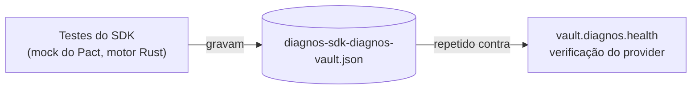

<h1 align="center">diagnos · integration</h1>

<p align="center"><b>SDK, CLI e API REST zero-knowledge para o cofre diagnos.</b></p>

<p align="center">

[English](README.md) · **Português (Brasil)**

</p>

<p align="center">
  <a href="https://github.com/diagnos-tech/integration/actions/workflows/unit-tests.yml?query=branch%3Adevelop"></a>
  <a href="https://github.com/diagnos-tech/integration/actions/workflows/unit-tests.yml?query=branch%3Adevelop"></a>
  <a href="https://github.com/diagnos-tech/integration/actions/workflows/contract-tests.yml?query=branch%3Adevelop"></a>
  <a href="https://github.com/diagnos-tech/integration/actions/workflows/ci.yml?query=branch%3Adevelop"></a>
  <a href="pyproject.toml"></a>
  <a href="LICENSE"></a>
</p>

<p align="center">
  <a href="apps/sdk/README.pt-BR.md"><b>SDK</b></a> ·
  <a href="apps/cli/README.pt-BR.md"><b>CLI</b></a> ·
  <a href="apps/api/README.pt-BR.md"><b>API</b></a> ·
  <a href="docs/PROTOCOL.pt-BR.md">Protocolo</a> ·
  <a href="contracts/README.pt-BR.md">Testes de contrato</a> ·
  <a href="CONTRIBUTING.pt-BR.md">Como contribuir</a> ·
  <a href="SECURITY.pt-BR.md">Segurança</a>
</p>

Três pacotes Python de código aberto para falar com o cofre diagnos sem nunca lidar com URL assinada, HMAC ou envelope
de chave. Tudo que é clínico é cifrado **dentro do seu processo** antes de tocar a rede — o cofre só vê ciphertext.
Estes pacotes fazem disso o caminho *fácil*.

> [!NOTE]
> **Situação: prévia 0.1.0.** Toda superfície — enrollment, sessões, assinatura de requisições, pacientes, exames,
> arquivos e pastas — fala o protocolo atual do cofre e é verificada contra ele pelos
> [testes de contrato](contracts/README.pt-BR.md). Limites conhecidos, e as questões ainda em aberto do lado do cofre,
> estão em [docs/COMPATIBILITY.pt-BR.md](docs/COMPATIBILITY.pt-BR.md).

## Escolha seu pacote

| Pacote | Use quando | Instalação |
|---|---|---|
| [**`diagnos`**](apps/sdk/README.pt-BR.md) — SDK | Seu código é Python. | `pip install diagnos` |
| [**`diagnos-cli`**](apps/cli/README.pt-BR.md) — CLI | Scripts, operação, uma olhada rápida. | `pipx install diagnos-cli` |
| [**`diagnos-api`**](apps/api/README.pt-BR.md) — API REST | Seu sistema fala HTTP, não Python. | [Docker / Kubernetes](apps/api/deploy/README.pt-BR.md) |

Mesmo token, mesmo fluxo de aprovação, mesmas garantias. A CLI e a API são cascas finas sobre o SDK — nunca
reimplementam um único byte de criptografia.

> [!NOTE]
> Ainda não está no PyPI. Até o primeiro release, instale do código-fonte — [Instalação](docs/guides/install.pt-BR.md)
> tem os comandos, e o [toolchain Rust](https://rustup.rs/) que o build precisa.

## Começando

**1. Consiga um token.** Um admin do workspace emite um token de service account no app web do diagnos:

```sh
export DIAGNOS_API_TOKEN="apikey-…"
```

**2. Faça o enrollment.** A primeira execução imprime um link e um código de 6 dígitos; um admin aprova no app web e
escolhe quais security groups este processo pode ler.

```python
from diagnos import Diagnos

with Diagnos() as vault:  # faz enrollment na entrada: imprime o link de aprovação + código
    print(vault.workspace_id)
    print(vault.security_groups)  # os grupos que o admin concedeu
```

```sh
diagnos login          # o mesmo enrollment, pelo terminal
diagnos status         # token, OpenBao e versão do SDK
```

**3. Use.** Pacientes, exames e arquivos pendem do mesmo objeto — `vault.patients`, `vault.exams`, `vault.drives`. O
[início rápido](docs/guides/quickstart.pt-BR.md) vai daqui até o primeiro paciente e o primeiro arquivo cifrados.

As chaves privadas nunca saem do processo e nada é gravado em disco, então o próximo processo precisa de uma nova
aprovação — isso é o desenho, não uma limitação. [Autenticação](docs/guides/authentication.pt-BR.md) mostra o
enrollment inteiro, e [Sessões](docs/guides/sessions.pt-BR.md#auto-unseal-com-openbao) como servidores reiniciam sem
humano.

## O que vem de graça

- **🔐 Ponta a ponta por padrão** — registros e arquivos são cifrados no seu processo; o cofre vê ciphertext,
  requisições assinadas e URLs pré-assinadas. [Exatamente o que ele vê](docs/guides/security.pt-BR.md#o-que-o-cofre-vê).
- **🛡️ Híbrido pós-quântico** — o enrollment usa X25519 + ML-KEM-768, então uma sessão gravada continua segura contra
  um adversário quântico futuro.
- **🧱 Chaves num enclave Rust** — memória travada com `mlock`, guard pages, fora de core dumps, zerada no `fork()` e
  ao descartar, nunca devolvida ao Python como `bytes`. Modelo de ameaça:
  [`apps/sdk/native/README.pt-BR.md`](apps/sdk/native/README.pt-BR.md).
- **🔁 Retentativa e relógio resolvidos** — retentativas idempotentes, sincronia de relógio com o cofre, exceções
  estáveis: [Erros](docs/guides/errors.pt-BR.md).
- **📐 Formatos de bytes travados** — [`docs/PROTOCOL.pt-BR.md`](docs/PROTOCOL.pt-BR.md) é normativo, e vetores de
  teste gerados da implementação de referência do cofre travam cada byte.

## Servidores sem humano

Uma aprovação humana a cada reinício serve num notebook; não serve num pod Kubernetes. Aponte o SDK para o
[OpenBao](https://openbao.org/) e ele salva a sessão desbloqueada logo após o enrollment e a restaura a cada subida —
uma troca deliberada, [explicada por inteiro](docs/guides/sessions.pt-BR.md#auto-unseal-com-openbao) antes de você
ligar. Manifestos prontos ficam em [`apps/api/deploy/`](apps/api/deploy/README.pt-BR.md): Docker Compose e Kubernetes,
com auto-unseal do OpenBao para AWS KMS, Azure Key Vault, GCP KMS, Transit, Shamir e chave estática.

## Documentação

| Comece aqui | Depois |
|---|---|
| [Início rápido](docs/guides/quickstart.pt-BR.md) · [Instalação](docs/guides/install.pt-BR.md) · [Conceitos](docs/guides/concepts.pt-BR.md) | [Autenticação](docs/guides/authentication.pt-BR.md) · [Sessões](docs/guides/sessions.pt-BR.md) · [Configuração](docs/guides/configuration.pt-BR.md) |
| [Pacientes](docs/guides/patients.pt-BR.md) · [Exames](docs/guides/exams.pt-BR.md) · [Arquivos](docs/guides/files.pt-BR.md) | [Erros](docs/guides/errors.pt-BR.md) · [Modelo de segurança](docs/guides/security.pt-BR.md) |
| [Guia da CLI](docs/guides/cli.pt-BR.md) · [Guia da API REST](docs/guides/api.pt-BR.md) | [Implantação](apps/api/deploy/README.pt-BR.md) · [Protocolo](docs/PROTOCOL.pt-BR.md) · [Compatibilidade](docs/COMPATIBILITY.pt-BR.md) |

O site de desenvolvedores publica estas mesmas páginas em `/dev/docs`, mais uma referência gerada a partir do código —
todo comando, rota e classe. [Como a doc é construída e checada](docs/README.pt-BR.md).

## Portões de qualidade

Todo badge acima é um workflow que você roda localmente com um comando.

| Badge | O que prova | Localmente |
|---|---|---|
| **Unit tests** | os três pacotes no CPython 3.11–3.13, mais o enclave Rust | `make test` |
| **Coverage** | cobertura de ramos combinada de `diagnos`, `diagnos-cli` e `diagnos-api`, com um piso que só sobe | `make cov` |
| **Contract tests** | o SDK manda e lê exatamente o que o contrato [Pact](https://pact.io) commitado diz (motor Rust `pact_ffi`) | `make contract` |
| **CI** | lint (Python, Rust, docstrings bilíngues, documentação), `mypy --strict`, lockfile, e a doc: todo exemplo roda, a referência está em dia | `make lint types docs-check` |

O contrato é guiado pelo consumidor: os testes do SDK gravam
[`contracts/diagnos-sdk-diagnos-vault.json`](contracts/diagnos-sdk-diagnos-vault.json), e o cofre verifica esse
mesmo arquivo contra o código real dele antes de implantar.



## Estrutura

```
integration/
├── apps/
│   ├── sdk/           diagnos          a biblioteca — tudo vive aqui
│   │   └── native/    diagnos._secure  enclave de memória em Rust
│   ├── cli/           diagnos-cli      `diagnos …` no seu terminal
│   └── api/           diagnos-api      fachada REST (FastAPI), só mTLS
│       └── deploy/    compose · k8s    manifestos prontos para rodar
├── contracts/         Pact             contrato do consumidor com o cofre + os testes dele
├── docs/              guides/          a documentação · reference/ gerada a partir do código
│                      PROTOCOL.md      formatos de bytes normativos · COMPATIBILITY.md · site.json
└── scripts/           docs/            as checagens por trás do `make lint`, do `make docs-check` e da CI
```

## Como contribuir

Você precisa de [uv](https://docs.astral.sh/uv/), Python 3.11–3.13 e, para construir o enclave do fonte,
[Rust](https://rustup.rs/) stable.

```sh
git clone https://github.com/diagnos-tech/integration && cd integration
make sync    # instala tudo e constrói o enclave Rust
make check   # exatamente o que a CI roda: lint, tipos, testes unitários e de contrato, doc
make         # lista todos os outros alvos
```

Leia o [CONTRIBUTING.pt-BR.md](CONTRIBUTING.pt-BR.md) antes do primeiro pull request. Vindo dos pacotes `imgexam`?
Veja o [MIGRATING.pt-BR.md](MIGRATING.pt-BR.md).

## Segurança

Achou uma vulnerabilidade? Por favor **não** abra issue pública — reporte em privado pelo
[GitHub Security Advisories](https://github.com/diagnos-tech/integration/security/advisories/new). Detalhes no
[SECURITY.pt-BR.md](SECURITY.pt-BR.md).

<p align="center"><sub><a href="LICENSE">Apache-2.0</a> · <a href="https://diagnos.health">diagnos.health</a></sub></p>
