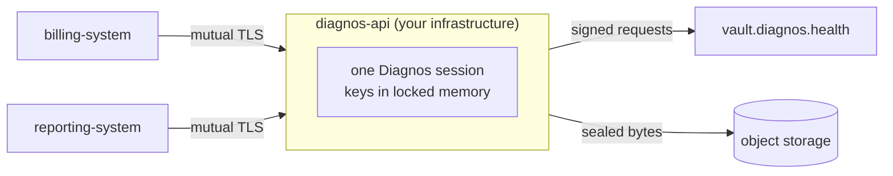

# REST API guide

**English** · [Português (Brasil)](api.pt-BR.md)

`diagnos-api` is the SDK behind HTTPS, for systems that would rather speak HTTP than import Python: one process, one
service account, one live session in memory, and every route a thin wrapper over `vault.patients`, `vault.exams` or
`vault.drives`. It adds no capability the SDK does not have. Every route, parameter and schema is in the
[API reference](../reference/openapi.json); this guide covers the parts around them.



Callers send and receive **plaintext JSON and files**; the API process encrypts and decrypts them with its session,
exactly as the SDK would in the caller's own process. That makes the API process part of your trusted zone — see
[the security model](security.md#the-rest-apis-boundary).

## Why mutual TLS

There is no `Authorization` header, no API key and no session cookie. The one identity the API accepts is a client
certificate signed by a CA this deployment chose to trust, configured once at startup. A bearer credential can be
pasted into a chat, committed by accident or replayed from a stolen log; a client certificate cannot be reproduced
from a leaked secret, because the caller must hold the private key the CA signed, and that key never travels.

For the same reason a reverse proxy's `X-Forwarded-*` headers are never identity: a header is a string anyone who
reached the proxy can set, while the client certificate is verified cryptographically by the TLS server before any
application code runs. A request without a valid certificate never completes the handshake — it never becomes an
HTTP request at all. `DIAGNOS_API_ALLOWED_CLIENT_CN` narrows the accepted certificates further, by common name.

## Certificates

Use the CA your organization already operates when there is one. For a trial, or a throwaway non-production CA:

```sh
# 1. A CA that signs both the server certificate and every client certificate.
openssl req -x509 -newkey rsa:4096 -sha256 -days 3650 -nodes \
  -keyout clients-ca-key.pem -out clients-ca.pem \
  -subj "/CN=diagnos-api internal CA"

# 2. The server's own certificate, presented to callers.
openssl req -newkey rsa:4096 -sha256 -nodes -keyout tls-key.pem -out server.csr \
  -subj "/CN=diagnos-api.internal"
openssl x509 -req -in server.csr -CA clients-ca.pem -CAkey clients-ca-key.pem \
  -CAcreateserial -days 825 -out tls.pem

# 3. One client certificate per system allowed to call the API. Its CN is what
#    DIAGNOS_API_ALLOWED_CLIENT_CN can restrict against.
openssl req -newkey rsa:4096 -sha256 -nodes -keyout client-key.pem -out client.csr \
  -subj "/CN=billing-system"
openssl x509 -req -in client.csr -CA clients-ca.pem -CAkey clients-ca-key.pem \
  -CAcreateserial -days 365 -out client.pem
```

Keep `clients-ca-key.pem` offline once you are done signing: the API needs only the CA's certificate to verify
callers, never its key.

## Running it

Four variables are required — the token and three PEM files; everything else has a default. The full list is in
[Deploying](../../apps/api/deploy/README.md#environment).

```sh
docker build -f apps/api/Dockerfile -t diagnos-api .   # from the repository root
docker run --rm -p 8443:8443 --cap-add=IPC_LOCK \
  -e DIAGNOS_API_TOKEN=apikey-… \
  -e DIAGNOS_API_MTLS_CA_FILE=/certs/clients-ca.pem \
  -e DIAGNOS_API_TLS_CERT_FILE=/certs/tls.pem -e DIAGNOS_API_TLS_KEY_FILE=/certs/tls-key.pem \
  -v "$PWD/certs:/certs:ro" diagnos-api
```

From a checkout, without Docker:

```sh
export DIAGNOS_API_TOKEN="apikey-…"
export DIAGNOS_API_MTLS_CA_FILE=./clients-ca.pem
export DIAGNOS_API_TLS_CERT_FILE=./tls.pem DIAGNOS_API_TLS_KEY_FILE=./tls-key.pem
uv run --package diagnos-api diagnos-api
```

`--cap-add=IPC_LOCK` lets the SDK lock its keys in RAM past the default 64 KiB limit; without it the API still runs,
in best-effort mode. Docker Compose, Kubernetes and OpenBao are covered in [Deploying](../../apps/api/deploy/README.md).
A missing variable or unreadable certificate stops the process at once with exit code `2` and a message naming it.

## Startup and the enrollment prompt

The API unlocks its session **before** it accepts the first connection. Without OpenBao, that means an enrollment on
every start: the approval link and code go to the process's `stderr` — the container log — and startup waits until a
workspace admin approves. With [OpenBao auto-unseal](sessions.md#auto-unseal-with-openbao), a restart restores the
saved session and starts serving at once.

```sh
docker logs -f diagnos-api   # the link and the code, on a fresh start without OpenBao
```

Shutting down closes the session's connections but does not end it, so a restarting pod restores the same session.
`POST /v1/session/lock` does end it: every data route then fails until the process restarts and enrolls again.

## Calling it

Every example below assumes these two shell variables:

```sh
API=https://diagnos-api.internal:8443
TLS="--cert client.pem --key client-key.pem --cacert clients-ca.pem"
```

Who is this process, and who am I?

```sh
curl $TLS "$API/v1/session"
```

```json
{
  "workspace_id": "ws_…",
  "account_id": "acct_…",
  "security_groups": ["sg_oncology", "sg_radiology"],
  "client": { "common_name": "billing-system", "serial": "…" }
}
```

### Patients and exams

```sh
# create — the record is plain JSON; the API seals it before it leaves the process
curl $TLS -H 'content-type: application/json' "$API/v1/patients" -d '{
  "record": { "legal_name": "Jane Doe", "display_name": "Jane", "birth_date": "1990-01-31" },
  "security_group": "sg_oncology",
  "tags": ["diabetes"]
}'

# list — anonymous rows unless summary=true decrypts names and tags
curl $TLS "$API/v1/patients?security_group=sg_oncology&summary=true&limit=50"

# read the newest content, or one version, or committed versions only
curl $TLS "$API/v1/patients/PATIENT_ID"
curl $TLS "$API/v1/patients/PATIENT_ID?include_draft=false"

# a complete new version, refused with 409 if someone saved since you read
curl $TLS -X PUT -H 'content-type: application/json' "$API/v1/patients/PATIENT_ID" -d '{
  "record": { "legal_name": "Jane Doe", "display_name": "Jane R." },
  "expected_latest_version_id": "VERSION_ID"
}'

# flags: no new version; DELETE moves to the trash, restore takes it back
curl $TLS -X POST "$API/v1/patients/PATIENT_ID/archive"
curl $TLS -X DELETE "$API/v1/patients/PATIENT_ID"
curl $TLS -X POST "$API/v1/patients/PATIENT_ID/restore"

# an exam needs its patient
curl $TLS -H 'content-type: application/json' "$API/v1/exams" -d '{
  "record": { "title": "Chest CT", "modality": "CT", "exam_date": "2026-09-01" },
  "patient_id": "PATIENT_ID",
  "security_group": "sg_radiology"
}'
```

Records, dates, drafts and conflicts behave exactly as in the SDK: [Patients](patients.md) and [Exams](exams.md). List
responses page with `limit` (1–200) and `cursor`, and return `next_cursor`.

### Files

A drive is a security group, so file routes carry the group in the path:

```sh
# upload: multipart/form-data, with optional exam_id, parent_id and mime_type fields
curl $TLS -F file=@scans/IM-0001.dcm -F exam_id=EXAM_ID "$API/v1/drives/sg_oncology/nodes"

# folders
curl $TLS -H 'content-type: application/json' "$API/v1/drives/sg_oncology/folders" -d '{"name": "CT 2026-09-01"}'

# list with names decrypted, filtered by folder or exam
curl $TLS "$API/v1/drives/sg_oncology/nodes?parent_id=FOLDER_ID"

# metadata and name; then the decrypted content, streamed, named by Content-Disposition
curl $TLS "$API/v1/drives/sg_oncology/nodes/NODE_ID"
curl $TLS -OJ "$API/v1/drives/sg_oncology/nodes/NODE_ID/content"
```

A node read under the wrong group answers `404`, exactly like one that does not exist. Downloads stream: the API
decrypts one chunk at a time, so memory stays flat whatever the file size. Uploads are buffered by the multipart
parser first — a request's size bounds the API's memory and temporary disk.

### From Python, without the SDK

Any HTTP client that can present a client certificate works:

```python no-run
import httpx

client = httpx.Client(
    base_url="https://diagnos-api.internal:8443",
    cert=("client.pem", "client-key.pem"),
    verify="clients-ca.pem",
)
page = client.get("/v1/patients", params={"summary": "true"}).raise_for_status().json()
print([row["summary"]["display_name"] for row in page["items"] if row["summary"]])
```

## Errors

Every non-2xx response is the same envelope — branch on `code`, and quote `trace_id` in a support ticket:

```json
{ "error": { "code": "DocumentVersionMismatch", "message": "…", "trace_id": "…" } }
```

[Errors](errors.md#every-exception) maps every SDK exception to its status; `422` (`invalid_request`) and the
mutual-TLS codes are listed there too.

## Operating it

- **One replica per service account.** A session belongs to one process. To scale out, give each replica its own
  service account and OpenBao path.
- **Logs are JSON lines** on `stdout`, for the `diagnos_api` and `diagnos` loggers — never a request body, a token or a
  file name.
- **The schema is served too**: `/docs` (Swagger UI) and `/openapi.json`, behind mutual TLS like everything else. The
  same document is the [API reference](../reference/openapi.json).
- **Liveness**: `GET /healthz` answers `200` once the session is unlocked. It is mTLS-gated as well, so Kubernetes
  probes the port over TCP instead.
