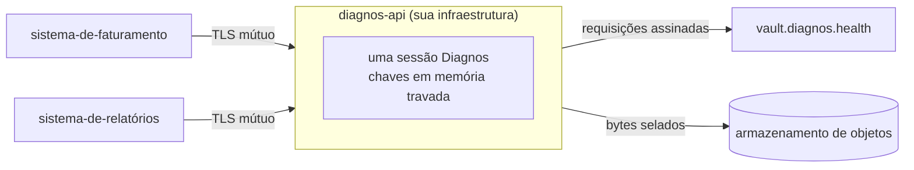

# Guia da API REST

[English](api.md) · **Português (Brasil)**

O `diagnos-api` é o SDK atrás de HTTPS, para sistemas que preferem falar HTTP a importar Python: um processo, uma
service account, uma sessão viva na memória, e toda rota um invólucro fino sobre `vault.patients`, `vault.exams` ou
`vault.drives`. Ele não acrescenta nenhuma capacidade que o SDK não tenha. Toda rota, parâmetro e schema está na
[referência da API](../reference/openapi.json); este guia cobre o que fica em volta deles.



Quem chama envia e recebe **JSON e arquivos em texto claro**; o processo da API os cifra e decifra com a sessão dele,
exatamente como o SDK faria no processo de quem chama. Isso torna o processo da API parte da sua zona confiável — veja
[o modelo de segurança](security.pt-BR.md#a-fronteira-da-api-rest).

## Por que TLS mútuo

Não existe header `Authorization`, API key nem cookie de sessão. A única identidade que a API aceita é um certificado
de cliente assinado por uma CA em que este deployment escolheu confiar, configurada uma vez na subida. Uma credencial
bearer pode ser colada num chat, commitada por acidente ou reproduzida de um log roubado; um certificado de cliente não
pode ser reproduzido a partir de um segredo vazado, porque quem chama precisa ter a chave privada que a CA assinou, e
essa chave nunca viaja.

Pelo mesmo motivo, os headers `X-Forwarded-*` de um proxy reverso nunca são identidade: um header é uma string que
qualquer um que alcançou o proxy consegue definir, enquanto o certificado de cliente é verificado criptograficamente
pelo servidor TLS antes de qualquer código de aplicação rodar. Uma requisição sem certificado válido nunca completa o
handshake — nem chega a virar uma requisição HTTP. `DIAGNOS_API_ALLOWED_CLIENT_CN` restringe ainda mais os
certificados aceitos, pelo common name.

## Certificados

Use a CA que a sua organização já opera, quando houver. Para testar, ou para uma CA descartável fora de produção:

```sh
# 1. Uma CA que assina tanto o certificado do servidor quanto todo certificado de cliente.
openssl req -x509 -newkey rsa:4096 -sha256 -days 3650 -nodes \
  -keyout clients-ca-key.pem -out clients-ca.pem \
  -subj "/CN=diagnos-api internal CA"

# 2. O certificado do próprio servidor, apresentado a quem chama.
openssl req -newkey rsa:4096 -sha256 -nodes -keyout tls-key.pem -out server.csr \
  -subj "/CN=diagnos-api.internal"
openssl x509 -req -in server.csr -CA clients-ca.pem -CAkey clients-ca-key.pem \
  -CAcreateserial -days 825 -out tls.pem

# 3. Um certificado de cliente por sistema autorizado a chamar a API. O CN dele é
#    o que DIAGNOS_API_ALLOWED_CLIENT_CN consegue restringir.
openssl req -newkey rsa:4096 -sha256 -nodes -keyout client-key.pem -out client.csr \
  -subj "/CN=billing-system"
openssl x509 -req -in client.csr -CA clients-ca.pem -CAkey clients-ca-key.pem \
  -CAcreateserial -days 365 -out client.pem
```

Guarde o `clients-ca-key.pem` offline quando terminar de assinar: a API só precisa do certificado da CA para verificar
quem chama, nunca da chave dela.

## Rodando

Quatro variáveis são obrigatórias — o token e três arquivos PEM; todo o resto tem padrão. A lista completa está em
[Implantação](../../apps/api/deploy/README.pt-BR.md#ambiente).

```sh
docker build -f apps/api/Dockerfile -t diagnos-api .   # da raiz do repositório
docker run --rm -p 8443:8443 --cap-add=IPC_LOCK \
  -e DIAGNOS_API_TOKEN=apikey-… \
  -e DIAGNOS_API_MTLS_CA_FILE=/certs/clients-ca.pem \
  -e DIAGNOS_API_TLS_CERT_FILE=/certs/tls.pem -e DIAGNOS_API_TLS_KEY_FILE=/certs/tls-key.pem \
  -v "$PWD/certs:/certs:ro" diagnos-api
```

De um checkout, sem Docker:

```sh
export DIAGNOS_API_TOKEN="apikey-…"
export DIAGNOS_API_MTLS_CA_FILE=./clients-ca.pem
export DIAGNOS_API_TLS_CERT_FILE=./tls.pem DIAGNOS_API_TLS_KEY_FILE=./tls-key.pem
uv run --package diagnos-api diagnos-api
```

`--cap-add=IPC_LOCK` deixa o SDK travar as chaves na RAM além do limite padrão de 64 KiB; sem ele a API ainda roda, em
modo best-effort. Docker Compose, Kubernetes e OpenBao estão em [Implantação](../../apps/api/deploy/README.pt-BR.md).
Uma variável ausente ou um arquivo de certificado ilegível param o processo na hora com código de saída `2` e uma
mensagem que o nomeia.

## A subida e o prompt de enrollment

A API desbloqueia a sessão **antes** de aceitar a primeira conexão. Sem OpenBao, isso significa um enrollment a cada
subida: o link de aprovação e o código vão para o `stderr` do processo — o log do container — e a subida espera até
um admin do workspace aprovar. Com o [auto-unseal com OpenBao](sessions.pt-BR.md#auto-unseal-com-openbao), um reinício
restaura a sessão salva e começa a servir na hora.

```sh
docker logs -f diagnos-api   # o link e o código, numa subida limpa sem OpenBao
```

Desligar fecha as conexões da sessão mas não a encerra, então um pod que reinicia restaura a mesma sessão.
`POST /v1/session/lock` a encerra: toda rota de dados falha a partir daí até o processo reiniciar e fazer enrollment
de novo.

## Chamando

Todo exemplo abaixo supõe estas duas variáveis de shell:

```sh
API=https://diagnos-api.internal:8443
TLS="--cert client.pem --key client-key.pem --cacert clients-ca.pem"
```

Quem é este processo, e quem sou eu?

```sh
curl $TLS "$API/v1/session"
```

```json
{
  "workspace_id": "ws_…",
  "account_id": "acct_…",
  "security_groups": ["sg_oncology", "sg_radiology"],
  "client": { "common_name": "billing-system", "serial": "…" }
}
```

### Pacientes e exames

```sh
# criar — o registro é JSON puro; a API o sela antes de sair do processo
curl $TLS -H 'content-type: application/json' "$API/v1/patients" -d '{
  "record": { "legal_name": "Maria da Silva", "display_name": "Maria", "birth_date": "1990-01-31" },
  "security_group": "sg_oncology",
  "tags": ["diabetes"]
}'

# listar — linhas anônimas a menos que summary=true decifre nomes e tags
curl $TLS "$API/v1/patients?security_group=sg_oncology&summary=true&limit=50"

# ler o conteúdo mais novo, ou uma versão, ou só versões confirmadas
curl $TLS "$API/v1/patients/PATIENT_ID"
curl $TLS "$API/v1/patients/PATIENT_ID?include_draft=false"

# uma versão nova e completa, recusada com 409 se alguém salvou depois da sua leitura
curl $TLS -X PUT -H 'content-type: application/json' "$API/v1/patients/PATIENT_ID" -d '{
  "record": { "legal_name": "Maria da Silva", "display_name": "Maria S." },
  "expected_latest_version_id": "VERSION_ID"
}'

# flags: sem versão nova; DELETE manda para a lixeira, restore traz de volta
curl $TLS -X POST "$API/v1/patients/PATIENT_ID/archive"
curl $TLS -X DELETE "$API/v1/patients/PATIENT_ID"
curl $TLS -X POST "$API/v1/patients/PATIENT_ID/restore"

# um exame precisa do paciente
curl $TLS -H 'content-type: application/json' "$API/v1/exams" -d '{
  "record": { "title": "TC de tórax", "modality": "CT", "exam_date": "2026-09-01" },
  "patient_id": "PATIENT_ID",
  "security_group": "sg_radiology"
}'
```

Registros, datas, rascunhos e conflitos se comportam exatamente como no SDK: [Pacientes](patients.pt-BR.md) e
[Exames](exams.pt-BR.md). Respostas de lista paginam com `limit` (1–200) e `cursor`, e devolvem `next_cursor`.

### Arquivos

Um drive é um security group, então as rotas de arquivo levam o grupo no path:

```sh
# subir: multipart/form-data, com os campos opcionais exam_id, parent_id e mime_type
curl $TLS -F file=@scans/IM-0001.dcm -F exam_id=EXAM_ID "$API/v1/drives/sg_oncology/nodes"

# pastas
curl $TLS -H 'content-type: application/json' "$API/v1/drives/sg_oncology/folders" -d '{"name": "TC 2026-09-01"}'

# listar com nomes decifrados, filtrando por pasta ou exame
curl $TLS "$API/v1/drives/sg_oncology/nodes?parent_id=FOLDER_ID"

# metadado e nome; depois o conteúdo decifrado, em stream, nomeado pelo Content-Disposition
curl $TLS "$API/v1/drives/sg_oncology/nodes/NODE_ID"
curl $TLS -OJ "$API/v1/drives/sg_oncology/nodes/NODE_ID/content"
```

Um nó lido sob o grupo errado responde `404`, exatamente como um que não existe. Downloads são em stream: a API decifra
um pedaço por vez, então a memória fica estável qualquer que seja o tamanho do arquivo. Uploads passam antes pelo
buffer do parser multipart — o tamanho de uma requisição limita a memória e o disco temporário da API.

### De Python, sem o SDK

Qualquer cliente HTTP que consiga apresentar um certificado de cliente funciona:

```python no-run
import httpx

client = httpx.Client(
    base_url="https://diagnos-api.internal:8443",
    cert=("client.pem", "client-key.pem"),
    verify="clients-ca.pem",
)
page = client.get("/v1/patients", params={"summary": "true"}).raise_for_status().json()
print([row["summary"]["display_name"] for row in page["items"] if row["summary"]])
```

## Erros

Toda resposta não-2xx é o mesmo envelope — decida por `code`, e cite o `trace_id` num chamado de suporte:

```json
{ "error": { "code": "DocumentVersionMismatch", "message": "…", "trace_id": "…" } }
```

[Erros](errors.pt-BR.md#toda-exceção) mapeia toda exceção do SDK para o status dela; o `422` (`invalid_request`) e os
códigos de TLS mútuo também estão listados lá.

## Operando

- **Uma réplica por service account.** Uma sessão pertence a um processo. Para escalar, dê a cada réplica a própria
  service account e o próprio path no OpenBao.
- **Os logs são linhas JSON** em `stdout`, para os loggers `diagnos_api` e `diagnos` — nunca um corpo de requisição,
  um token ou um nome de arquivo.
- **O schema também é servido**: `/docs` (Swagger UI) e `/openapi.json`, atrás de TLS mútuo como todo o resto. O
  mesmo documento é a [referência da API](../reference/openapi.json).
- **Vivacidade**: `GET /healthz` responde `200` quando a sessão está desbloqueada. Também é travado por mTLS, então o
  Kubernetes sonda a porta por TCP.
