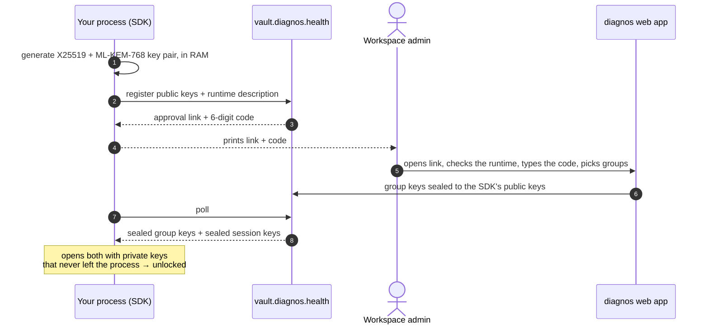

# Authentication

**English** · [Português (Brasil)](authentication.pt-BR.md)

A diagnos process needs two things before it can read a single record: a **token** that says which service account
it is, and an **enrollment** that a person approved, which says what this particular process may decrypt. Neither is
enough alone — a leaked token cannot decrypt anything without a human approving the process that holds it.

## The service-account token

A workspace admin creates a service account in the diagnos web app and issues its token, an `apikey-` followed by a
JWT. The SDK reads four claims from it, without verifying the signature — only the vault holds the key to do that:

| Claim | Exposed as | Meaning |
|---|---|---|
| `workspace_id` | `vault.workspace_id` | the workspace every URL is built for |
| `account_id` | `vault.account_id` | the account that owns the service account |
| `name` | `vault.name` | `slug@<workspace_id>.diagnos.health`, for humans |
| `sub` | `vault.key_id` | the token's key id — what an admin rotates or revokes |

```python
from diagnos import Diagnos

vault = Diagnos()  # parses DIAGNOS_API_TOKEN; nothing touches the network yet
print(vault.workspace_id, vault.account_id, vault.name, vault.key_id)
print(repr(vault))  # the token itself is always redacted
```

There are three ways to hand the token over, most common first:

| How | When |
|---|---|
| `DIAGNOS_API_TOKEN` in the environment | always, unless you have a reason not to |
| `Diagnos(token="apikey-…")` | one process that talks as two service accounts |
| `Diagnos(settings=Settings(api_token=…))` | no environment at all — see [Configuration](configuration.md) |

The CLI also takes `--token` for a single invocation. The token has no expiry claim: revocation is server-side, and a
revoked token fails its next signed call with `DiagnosPermissionError` (`ServiceAccountRevoked`).

> [!WARNING]
> The token is a bearer credential: anyone who holds it can *ask* for an enrollment as this service account. Keep it
> in a secret store or a mounted file, never in a repository or a log line. The SDK never prints it — every `repr`
> shows only its last four characters.

## Enrollment



1. The process generates a hybrid key pair — X25519 plus ML-KEM-768, so a recorded enrollment stays safe against a
   future quantum adversary — and registers the public half with the vault.
2. It shows a link and a 6-digit code. An admin opens the link in the web app, checks the description of the machine
   asking, types the code and picks the security groups this process may read.
3. The web app seals the keys of those groups **to the process's public keys**; the vault seals the session keys the
   same way. The process opens both with private keys that never left its memory.

Nothing is written to disk. The approval is the security model, not friction to route around: there is no API to
approve an enrollment programmatically.

### What the approver sees

Next to the code, the approval page shows the `runtime` the process described itself with, so a person can notice
"I don't recognize this machine" before approving:

| Field | Example |
|---|---|
| `sdk_name`, `sdk_version` | `diagnos-python`, `0.1.0` |
| `language`, `os`, `arch` | `python 3.12`, `linux`, `x86_64` |
| `hostname`, `user` | `billing-worker-7f9c`, `app` (when they can be read) |
| `container`, `cloud` | `true`, `aws` (detected, best effort) |

> [!IMPORTANT]
> Approve only an enrollment you started and whose runtime you recognize. An approval is what turns a token into the
> ability to decrypt a group's data.

### Waiting for the approval

`unlock()` blocks until the admin answers, polling at the interval the vault sets. Three endings are possible:

| Outcome | What happens |
|---|---|
| approved | `unlock()` returns; the process is unlocked |
| denied | `EnrollmentDeniedError` |
| nobody answered before `expires_at` | `EnrollmentExpiredError` — run it again for a new link and code |

```python
from diagnos import Diagnos, EnrollmentDeniedError, EnrollmentExpiredError

try:
    vault = Diagnos()
    vault.unlock()
except EnrollmentDeniedError:
    raise SystemExit("an admin denied this process") from None
except EnrollmentExpiredError:
    raise SystemExit("nobody approved in time; run again for a new code") from None
```

You rarely call `unlock()` yourself: the first touch of `vault.patients`, `vault.exams` or `vault.drives` unlocks
lazily, and `with Diagnos() as vault:` unlocks on entry. It is idempotent either way.

### Showing the prompt yourself

By default the link and the code go to `stderr`, as plain text that reads the same in a terminal and in a CI log.
To send them somewhere else — a chat channel, a pager, your own UI — pass `on_prompt`. It is called once, before the
wait starts, with an `EnrollmentPrompt`:

```python
from diagnos import Diagnos, EnrollmentPrompt


def notify(prompt: EnrollmentPrompt) -> None:
    # EnrollmentPrompt: enrollment_id, approval_url, code, expires_at (Unix seconds)
    print(f"Approve {prompt.approval_url} with code {prompt.code} before {prompt.expires_at}")


vault = Diagnos(on_prompt=notify)
vault.unlock()
```

### Where the prompt appears

| Package | Where the link and code go |
|---|---|
| SDK | `stderr`, or your `on_prompt` |
| CLI | a panel on `stderr`, then a spinner until approved — see the [CLI guide](cli.md#enrollment-in-the-terminal) |
| REST API | the process's `stderr`, i.e. the container log; startup waits until approved — see the [API guide](api.md#startup-and-the-enrollment-prompt) |

## Which groups a process gets

The admin decides at approval time; `vault.security_groups` lists what was granted. Touching data of any other group
raises `GroupKeyUnavailable` — a permission gap, not a crypto failure — and list rows of such groups come back with
`summary=None` instead of failing the page:

```python
from diagnos import Diagnos, GroupKeyUnavailable

with Diagnos() as vault:
    print("granted:", vault.security_groups)
    try:
        vault.patients.create({"legal_name": "Jane Doe", "display_name": "Jane"}, security_group="sg_cardiology")
    except GroupKeyUnavailable as error:
        print("not granted:", error)
```

The fix is a new enrollment that includes the group: restart the process (or clear its saved session, if it uses
[OpenBao](sessions.md#auto-unseal-with-openbao)) and ask the admin to pick it.

## Good practice

- **One service account per integration**, and one per replica if it runs as several processes: an admin can then
  revoke exactly one of them.
- **The fewest groups that work.** An enrollment can decrypt everything in the groups it holds.
- **The token comes from a secret store** — a Kubernetes Secret, your CI's secret variables — straight into
  `DIAGNOS_API_TOKEN`, never from a file in the repository. `diagnos` itself never logs it.
- **Servers restart without a human** only through OpenBao auto-unseal — a deliberate trade described in
  [Sessions](sessions.md).
