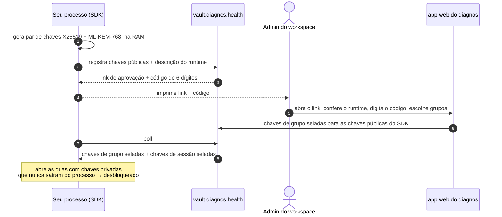

# Autenticação

[English](authentication.md) · **Português (Brasil)**

Um processo diagnos precisa de duas coisas antes de ler um único registro: um **token** que diz qual service account
ele é, e um **enrollment** que uma pessoa aprovou, que diz o que este processo em particular pode decifrar. Nenhum dos
dois basta sozinho — um token vazado não decifra nada sem uma pessoa aprovar o processo que o segura.

## O token da service account

Um admin do workspace cria uma service account no app web do diagnos e emite o token dela, um `apikey-` seguido de
um JWT. O SDK lê quatro claims dele, sem conferir a assinatura — só o cofre tem a chave para isso:

| Claim | Exposta como | Significado |
|---|---|---|
| `workspace_id` | `vault.workspace_id` | o workspace para o qual toda URL é montada |
| `account_id` | `vault.account_id` | a conta dona da service account |
| `name` | `vault.name` | `slug@<workspace_id>.diagnos.health`, para humanos |
| `sub` | `vault.key_id` | o id da chave do token — o que um admin rotaciona ou revoga |

```python
from diagnos import Diagnos

vault = Diagnos()  # lê DIAGNOS_API_TOKEN; nada toca a rede ainda
print(vault.workspace_id, vault.account_id, vault.name, vault.key_id)
print(repr(vault))  # o token em si é sempre redigido
```

Há três jeitos de entregar o token, do mais comum ao menos:

| Como | Quando |
|---|---|
| `DIAGNOS_API_TOKEN` no ambiente | sempre, a menos que você tenha um motivo para não |
| `Diagnos(token="apikey-…")` | um processo que fala como duas service accounts |
| `Diagnos(settings=Settings(api_token=…))` | sem ambiente nenhum — veja [Configuração](configuration.pt-BR.md) |

A CLI também aceita `--token` para uma única invocação. O token não tem claim de expiração: a revogação é do lado do
servidor, e um token revogado falha na chamada assinada seguinte com `DiagnosPermissionError`
(`ServiceAccountRevoked`).

> [!WARNING]
> O token é uma credencial bearer: quem o tem consegue *pedir* um enrollment como esta service account. Guarde-o num
> cofre de segredos ou num arquivo montado, nunca num repositório ou numa linha de log. O SDK nunca o imprime — todo
> `repr` mostra só os quatro últimos caracteres.

## Enrollment



1. O processo gera um par de chaves híbrido — X25519 mais ML-KEM-768, para um enrollment gravado continuar seguro
   contra um adversário quântico no futuro — e registra a metade pública no cofre.
2. Ele mostra um link e um código de 6 dígitos. Um admin abre o link no app web, confere a descrição da máquina que
   está pedindo, digita o código e escolhe os security groups que este processo pode ler.
3. O app web sela as chaves desses grupos **para as chaves públicas do processo**; o cofre sela as chaves de sessão do
   mesmo jeito. O processo abre as duas com chaves privadas que nunca saíram da memória dele.

Nada é gravado em disco. A aprovação é o modelo de segurança, não atrito a contornar: não existe API para aprovar um
enrollment por programa.

### O que quem aprova vê

Ao lado do código, a página de aprovação mostra o `runtime` com que o processo se descreveu, para uma pessoa perceber
"não reconheço esta máquina" antes de aprovar:

| Campo | Exemplo |
|---|---|
| `sdk_name`, `sdk_version` | `diagnos-python`, `0.1.0` |
| `language`, `os`, `arch` | `python 3.12`, `linux`, `x86_64` |
| `hostname`, `user` | `billing-worker-7f9c`, `app` (quando dá para ler) |
| `container`, `cloud` | `true`, `aws` (detectados, best-effort) |

> [!IMPORTANT]
> Aprove só um enrollment que você iniciou e cujo runtime você reconhece. Uma aprovação é o que transforma um token
> na capacidade de decifrar os dados de um grupo.

### Esperando a aprovação

`unlock()` bloqueia até o admin responder, fazendo poll no intervalo que o cofre define. Há três finais possíveis:

| Desfecho | O que acontece |
|---|---|
| aprovado | `unlock()` retorna; o processo está desbloqueado |
| negado | `EnrollmentDeniedError` |
| ninguém respondeu antes de `expires_at` | `EnrollmentExpiredError` — rode de novo para um link e um código novos |

```python
from diagnos import Diagnos, EnrollmentDeniedError, EnrollmentExpiredError

try:
    vault = Diagnos()
    vault.unlock()
except EnrollmentDeniedError:
    raise SystemExit("um admin negou este processo") from None
except EnrollmentExpiredError:
    raise SystemExit("ninguém aprovou a tempo; rode de novo para um código novo") from None
```

Você raramente chama `unlock()` à mão: o primeiro toque em `vault.patients`, `vault.exams` ou `vault.drives`
desbloqueia de forma preguiçosa, e `with Diagnos() as vault:` desbloqueia na entrada. É idempotente de todo jeito.

### Mostrando o prompt você mesmo

Por padrão o link e o código vão para `stderr`, como texto puro que se lê igual num terminal e num log de CI. Para
mandá-los a outro lugar — um canal de chat, um pager, a sua própria interface — passe `on_prompt`. Ele é chamado uma
vez, antes de a espera começar, com um `EnrollmentPrompt`:

```python
from diagnos import Diagnos, EnrollmentPrompt


def notify(prompt: EnrollmentPrompt) -> None:
    # EnrollmentPrompt: enrollment_id, approval_url, code, expires_at (segundos Unix)
    print(f"Aprove {prompt.approval_url} com o código {prompt.code} antes de {prompt.expires_at}")


vault = Diagnos(on_prompt=notify)
vault.unlock()
```

### Onde o prompt aparece

| Pacote | Para onde vão o link e o código |
|---|---|
| SDK | `stderr`, ou o seu `on_prompt` |
| CLI | um painel em `stderr`, depois um spinner até a aprovação — veja o [guia da CLI](cli.pt-BR.md#enrollment-no-terminal) |
| API REST | o `stderr` do processo, isto é, o log do container; a subida espera a aprovação — veja o [guia da API](api.pt-BR.md#a-subida-e-o-prompt-de-enrollment) |

## Quais grupos um processo recebe

O admin decide na hora de aprovar; `vault.security_groups` lista o que foi concedido. Tocar dados de qualquer outro
grupo lança `GroupKeyUnavailable` — uma lacuna de permissão, não uma falha de cripto — e as linhas de lista desses
grupos voltam com `summary=None` em vez de derrubar a página:

```python
from diagnos import Diagnos, GroupKeyUnavailable

with Diagnos() as vault:
    print("concedidos:", vault.security_groups)
    try:
        vault.patients.create({"legal_name": "Maria da Silva", "display_name": "Maria"}, security_group="sg_cardiology")
    except GroupKeyUnavailable as error:
        print("não concedido:", error)
```

A correção é um enrollment novo que inclua o grupo: reinicie o processo (ou limpe a sessão salva dele, se ele usa
[OpenBao](sessions.pt-BR.md#auto-unseal-com-openbao)) e peça ao admin para escolhê-lo.

## Boas práticas

- **Uma service account por integração**, e uma por réplica se ela roda como vários processos: um admin consegue
  então revogar exatamente uma delas.
- **O mínimo de grupos que funciona.** Um enrollment decifra tudo nos grupos que ele tem.
- **O token vem de um cofre de segredos** — um Secret do Kubernetes, as variáveis secretas da sua CI — direto para
  `DIAGNOS_API_TOKEN`, nunca de um arquivo no repositório. O `diagnos` em si nunca o loga.
- **Servidores reiniciam sem uma pessoa** só pelo auto-unseal com OpenBao — uma troca deliberada, descrita em
  [Sessões](sessions.pt-BR.md).
