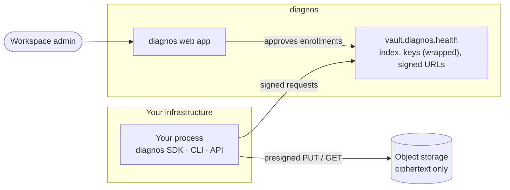
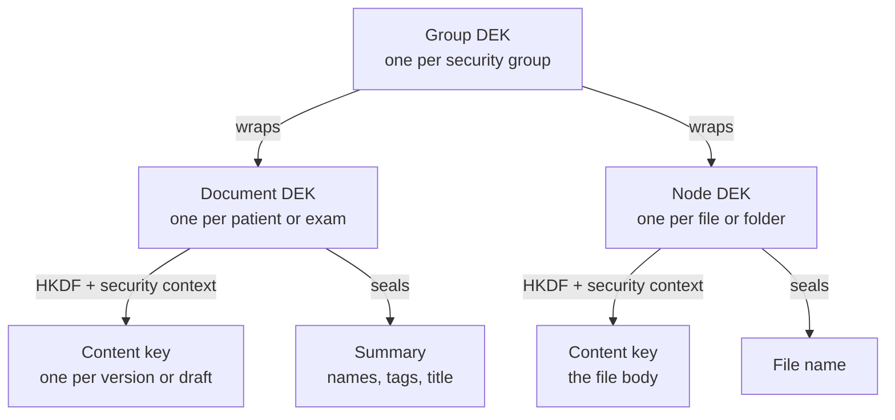

# Concepts

**English** · [Português (Brasil)](concepts.pt-BR.md)

The model behind every call, on one page. Each guide after this one assumes these words mean exactly what they mean
here.

## The pieces



Your process encrypts and decrypts. The vault keeps an **index** (who owns what, which versions exist, keys wrapped
under other keys) and hands out short-lived signed URLs; the bytes themselves go straight between your process and
object storage, already sealed. The web app is where people work — and where an admin approves your process.

## Workspace and service account

A **workspace** is one organization's space in diagnos: its people, its patients, its files. A **service account** is
a non-human member of a workspace, created by an admin for one integration. Its token, `DIAGNOS_API_TOKEN`, is how
your process says *which* service account it is. [Authentication](authentication.md) covers the token in full.

## Enrollment and session

Holding the token is not enough to read anything. Each process **enrolls**: it generates a key pair in memory, a
workspace admin approves it in the web app, and the process receives a **session** — the keys that sign its
requests — plus the keys of the security groups the admin granted. A session belongs to the process that earned it,
lives only in its memory and expires; [Sessions](sessions.md) covers its lifecycle and how servers restart without a
human.

## Security groups and keys

A **security group** is the unit of access inside a workspace — typically a team or a department (`sg_oncology`).
Each group has a 32-byte key, the **group DEK**. An enrollment approval hands your process the DEKs of the groups
the admin picked, and nothing else: data of any other group stays unreadable to it, even though the vault would
happily list its metadata.

Keys nest, so that no long-lived key ever encrypts content directly:



The wrapped keys are stored in the vault next to the data they protect (`encrypted_keys`), so anyone holding the
group DEK — the web app, or your approved process — can open them, and nobody else can. The exact derivations are in
[PROTOCOL.md](../PROTOCOL.md#7-key-and-content-envelope).

> [!IMPORTANT]
> A document or file belongs to **exactly one** security group. Sharing a patient with another team means copying
> it into that team's group, never sharing its key.

## Documents: patients and exams

Patients and exams are **versioned documents**. The SDK models their content as records — `PatientRecord` and
`ExamRecord` — and every write seals a complete record as a new version.

### Versions

A change is always a new, complete version; there are no partial updates. Versions are never rewritten or removed,
so the history of a document is its list of versions (`index.versions`). One version at a time may be *pending*
(reserved but not committed) per document; the SDK reserves, uploads and commits in one call.

### Drafts

The web editor autosaves a **draft head** next to the versions — overwritten in place, never a version. When the
draft is newer than the latest version, it *is* the newest content, and `get()` returns it (`from_draft` is
`True`). The SDK reads drafts; it never writes them.

### The sealed summary

Every write also seals a short **summary** of the record under the document DEK — a patient's names, external id,
birth date and tags; an exam's title, modality and date. Lists open these summaries without downloading any version,
which is what makes `vault.patients.list()` cheap. Identity documents never go into a summary.

### Clear metadata and flags

A few fields are deliberately **not** encrypted, because the vault itself must read them to route and authorize:

| Field | On | Why it is clear |
|---|---|---|
| `security_group_id` | every document and file | access control is decided by group |
| `patient_id` | exams | the vault links an exam to its patient without opening either |
| `specialist_ids` | patients (optional) | the vault filters by assigned specialist |
| `report_status` | exams, when set | `draft` or `published`, a workflow state |
| `is_archived`, `is_deleted` | every document | flags, set without a new version |

Archive and delete are flags, not versions. **Delete is never a hard delete**: it moves the document to the trash,
`restore` brings it back, and its encrypted history stays. The complete list of what the vault can observe is in the
[security model](security.md#what-the-vault-sees).

## Files and folders: nodes

Every file — DICOM, image, video, PDF — and every folder is a **node**. A node belongs to one security group, may be
linked to an exam (`exam_id`) and may live in a folder (`parent_id`). Each file gets its own key, and its name is
sealed too; reading one needs only its `node_id`. Nodes are not versioned: an upload is a new node.

A file is `pending` from its reservation until its bytes reach storage and the upload is confirmed, then `ready`.
Lists show ready nodes unless asked for pending ones.

## Lists and cursors

Every list is **cursor-paginated**. `list()` returns one `Page` — its `items` and a `next_cursor` that is `None` on
the last page — and `iter_all()` follows the cursors for you:

```python
from diagnos import Diagnos

with Diagnos() as vault:
    page = vault.patients.list(limit=50)
    while True:
        for row in page:  # iterating a Page iterates its items
            print(row.id)
        if page.next_cursor is None:
            break
        page = vault.patients.list(limit=50, cursor=page.next_cursor)

    total = sum(1 for _ in vault.patients.iter_all())  # the same walk, done for you
```

A page holds at most 200 items. The CLI prints the cursor under each page, and the REST API returns it as
`next_cursor`.
