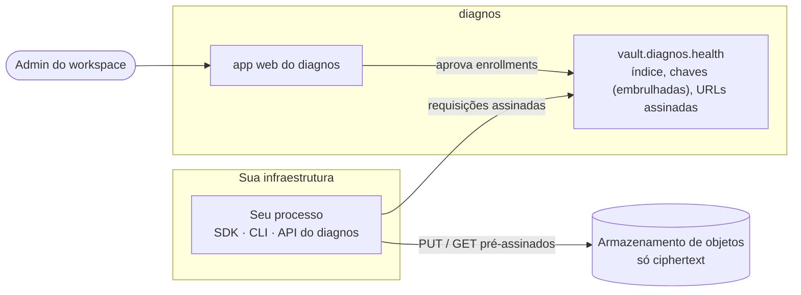
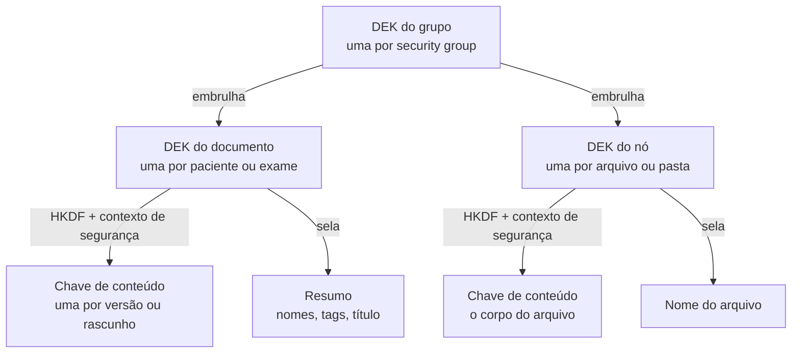

# Conceitos

[English](concepts.md) · **Português (Brasil)**

O modelo por trás de toda chamada, numa página. Todo guia depois deste supõe que estas palavras significam
exatamente o que significam aqui.

## As peças



O seu processo cifra e decifra. O cofre guarda um **índice** (quem é dono do quê, quais versões existem, chaves
embrulhadas sob outras chaves) e entrega URLs assinadas de vida curta; os bytes em si vão direto entre o seu processo
e o armazenamento de objetos, já selados. O app web é onde as pessoas trabalham — e onde um admin aprova o seu
processo.

## Workspace e service account

Um **workspace** é o espaço de uma organização no diagnos: as pessoas, os pacientes, os arquivos. Uma **service
account** é um membro não humano de um workspace, criado por um admin para uma integração. O token dela,
`DIAGNOS_API_TOKEN`, é como o seu processo diz *qual* service account ele é. [Autenticação](authentication.pt-BR.md)
cobre o token por inteiro.

## Enrollment e sessão

Ter o token não basta para ler nada. Cada processo faz **enrollment**: gera um par de chaves na memória, um admin do
workspace o aprova no app web, e o processo recebe uma **sessão** — as chaves que assinam as requisições dele — mais
as chaves dos security groups que o admin concedeu. Uma sessão pertence ao processo que a conquistou, vive só na
memória dele e expira; [Sessões](sessions.pt-BR.md) cobre o ciclo de vida dela e como servidores reiniciam sem uma
pessoa.

## Security groups e chaves

Um **security group** é a unidade de acesso dentro de um workspace — em geral uma equipe ou um departamento
(`sg_oncology`). Cada grupo tem uma chave de 32 bytes, a **DEK do grupo**. Uma aprovação de enrollment entrega ao seu
processo as DEKs dos grupos que o admin escolheu, e nada mais: os dados de qualquer outro grupo continuam ilegíveis
para ele, mesmo que o cofre liste o metadado deles sem problema.

As chaves se aninham, para nenhuma chave de vida longa cifrar conteúdo diretamente:



As chaves embrulhadas ficam no cofre ao lado dos dados que protegem (`encrypted_keys`), então quem tem a DEK do grupo
— o app web, ou o seu processo aprovado — consegue abri-las, e mais ninguém. As derivações exatas estão no
[PROTOCOL.pt-BR.md](../PROTOCOL.pt-BR.md#7-envelope-de-chave-e-de-conteúdo).

> [!IMPORTANT]
> Um documento ou arquivo pertence a **exatamente um** security group. Compartilhar um paciente com outra equipe é
> copiá-lo para o grupo dela, nunca compartilhar a chave.

## Documentos: pacientes e exames

Pacientes e exames são **documentos versionados**. O SDK modela o conteúdo deles como registros — `PatientRecord` e
`ExamRecord` — e toda gravação sela um registro completo como uma versão nova.

### Versões

Uma mudança é sempre uma versão nova e completa; não existe atualização parcial. Versões nunca são reescritas nem
removidas, então o histórico de um documento é a lista de versões dele (`index.versions`). Uma versão por vez pode
estar *pendente* (reservada mas não confirmada) por documento; o SDK reserva, sobe e confirma numa chamada só.

### Rascunhos

O editor web salva sozinho uma **cabeça de rascunho** ao lado das versões — sobrescrita no lugar, nunca uma versão.
Quando o rascunho é mais novo que a versão corrente, ele *é* o conteúdo mais novo, e `get()` o devolve (`from_draft`
é `True`). O SDK lê rascunhos; nunca os grava.

### O resumo selado

Toda gravação também sela um **resumo** curto do registro sob a DEK do documento — os nomes, o id externo, a data de
nascimento e as tags de um paciente; o título, a modalidade e a data de um exame. As listas abrem esses resumos sem
baixar nenhuma versão, e é isso que torna `vault.patients.list()` barato. Documentos de identidade nunca entram num
resumo.

### Metadado em claro e flags

Alguns campos de propósito **não** são cifrados, porque o próprio cofre precisa lê-los para rotear e autorizar:

| Campo | Em | Por que fica em claro |
|---|---|---|
| `security_group_id` | todo documento e arquivo | o controle de acesso é decidido por grupo |
| `patient_id` | exames | o cofre liga um exame ao paciente sem abrir nenhum dos dois |
| `specialist_ids` | pacientes (opcional) | o cofre filtra pelo especialista atribuído |
| `report_status` | exames, quando definido | `draft` ou `published`, um estado de fluxo de trabalho |
| `is_archived`, `is_deleted` | todo documento | flags, ligadas sem versão nova |

Arquivar e apagar são flags, não versões. **Apagar nunca é apagar de verdade**: manda o documento para a lixeira,
`restore` o traz de volta, e o histórico cifrado fica. A lista completa do que o cofre consegue observar está no
[modelo de segurança](security.pt-BR.md#o-que-o-cofre-vê).

## Arquivos e pastas: nós

Todo arquivo — DICOM, imagem, vídeo, PDF — e toda pasta é um **nó**. Um nó pertence a um security group, pode estar
ligado a um exame (`exam_id`) e pode morar numa pasta (`parent_id`). Cada arquivo ganha a própria chave, e o nome
dele também é selado; ler um só precisa do `node_id`. Nós não são versionados: um upload é um nó novo.

Um arquivo fica `pending` desde a reserva até os bytes chegarem ao armazenamento e o upload ser confirmado, e então
`ready`. As listas mostram nós prontos, a menos que se peça os pendentes.

## Listas e cursores

Toda lista é **paginada por cursor**. `list()` devolve uma `Page` — os `items` e um `next_cursor` que é `None` na
última página — e `iter_all()` segue os cursores por você:

```python
from diagnos import Diagnos

with Diagnos() as vault:
    page = vault.patients.list(limit=50)
    while True:
        for row in page:  # iterar uma Page itera os items dela
            print(row.id)
        if page.next_cursor is None:
            break
        page = vault.patients.list(limit=50, cursor=page.next_cursor)

    total = sum(1 for _ in vault.patients.iter_all())  # o mesmo percurso, feito por você
```

Uma página tem no máximo 200 items. A CLI imprime o cursor embaixo de cada página, e a API REST o devolve como
`next_cursor`.
