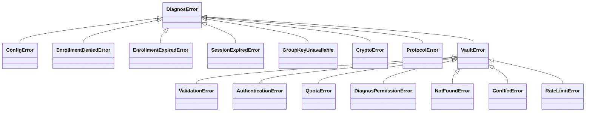

# Errors

**English** · [Português (Brasil)](errors.pt-BR.md)

Every exception the SDK raises is importable from `diagnos`, and every one of them names a decision you have to make:
fix the input, wait, re-enroll, ask an admin, or report a bug. Catch by class, never by message — messages are for
people and may change; classes and `code`s are the contract. The CLI and the REST API translate the same classes
into exit codes and HTTP statuses, so this page is the one table for all three.

## The hierarchy



`VaultError` and its subclasses mean *the vault answered with an error*; they carry the vault's `code`, the HTTP
`status`, and the `trace_id` and `request_id` a support ticket needs. Everything else under `DiagnosError` is
decided locally, before or after talking to the vault.

## Every exception

| Class | Raised when | What to do | CLI exit | API status |
|---|---|---|---|---|
| `ConfigError` | `DIAGNOS_API_TOKEN` missing or malformed; an invalid env var; OpenBao configured without the `openbao` extra | fix the configuration | `2` | exits `2` at startup |
| `EnrollmentDeniedError` | an admin denied the enrollment | nothing to retry — ask why | `3` | startup fails |
| `EnrollmentExpiredError` | nobody approved before `expires_at` | run again for a new link and code | `3` | startup fails |
| `SessionExpiredError` | a signed call with no live session | `unlock()` again (resource calls do it for you) | `3` | `401` `session_expired` |
| `GroupKeyUnavailable` | the data's security group was not granted to this enrollment | a new enrollment that includes it | `3` | `403` `group_key_unavailable` |
| `CryptoError` | an envelope did not open: wrong key or tampered bytes, deliberately indistinguishable | do not retry; report it | `1` | `500` `crypto_error` |
| `ProtocolError` | the vault answered something the protocol does not allow | do not retry; report it with the SDK version, or upgrade | `1` | `502` `protocol_error` |
| `ValidationError` | the vault refused the request as invalid (400, 413) | fix the input | `1` | `400` |
| `AuthenticationError` | token, session or signature rejected (401) | usually re-enroll | `3` | `401` |
| `QuotaError` | the workspace has no credit for this (402); nothing was done | buy credit, or wait for the budget | `5` | `402` |
| `DiagnosPermissionError` | this service account may not do this here (403), incl. a revoked token | ask an admin | `3` | `403` |
| `NotFoundError` | no such document, version or file (404) | check the id | `4` | `404` |
| `ConflictError` | a pending or newer version, a replay, or an upload that never reached storage (409) | read again and merge, or upload again | `7` | `409` |
| `RateLimitError` | still rate limited after the SDK's own backoff (429) | slow down; retry later | `6` | `429` |
| `VaultError` | any other vault error — a 5xx after one retry, or a response that was not JSON (`InvalidResponse`) | retry later; report with `trace_id` if it persists | `1` | `502` |

Which vault `code` maps to which class — `DocumentVersionMismatch`, `QuotaExceeded`, `ServiceAccountRevoked` and the
rest — is normative, and lives in [PROTOCOL.md §12](../PROTOCOL.md#12-errors).

Three failures are not `DiagnosError`s, because they are programming errors caught before anything is sent:

| Exception | When |
|---|---|
| `pydantic.ValidationError` | a record with a misspelled or invalid field — see [Patients](patients.md#typos-are-refused-unknown-fields-are-kept) |
| `TypeError` | `security_group` given as a list — a document belongs to exactly one group |
| `ValueError` | a naive `datetime`, an unparseable date, an upload of `bytes` without a `name` |

`MemoryLockWarning` is a warning, not an error: the OS refused to lock a key in RAM, and the process runs on with
every other protection. `DIAGNOS_MEMORY_LOCK=require` turns it into a hard failure — see
[Configuration](configuration.md#memory-and-process-hardening).

## What the SDK already retries

Before you wrap a call in a retry loop: the SDK already retries everything that is safe to retry, with a fresh
signature each time, and raises only when retrying stopped making sense.

| Condition | What the SDK does | Then raises |
|---|---|---|
| first signed request of a process | syncs the clock with `GET /time` (median of three) | — |
| `401 SignatureTimestampSkew` | resyncs the clock, retries once | `AuthenticationError` |
| `409 ReplayDetected` | retries once with a new nonce | `ConflictError` |
| `429` | waits `Retry-After` if sent, else 0.5 s, 1 s, 2 s with jitter — three retries | `RateLimitError` |
| any `5xx` | one retry after 1 s | `VaultError` |
| `409 DocumentVersionPending` on a write | another writer holds the slot: retries after 1.5 s and 3 s | `ConflictError` |
| a commit lost on the network or to a `5xx` | replays it after 0.5 s and 1 s — commits are idempotent | `VaultError` |
| a multipart upload failing midway | aborts it, so the vault releases the space | the original error |

What is left for you: `ConflictError` with `DocumentVersionMismatch` means *someone saved in between* — read again,
merge, write again ([example](patients.md#safe-concurrent-writes)). `ConflictError` with `UploadIncomplete` means a
file's bytes never reached storage — upload that file again. `RateLimitError` and `VaultError` are worth one more
try after a longer pause.

## Clock skew

Every signed request carries a timestamp the vault accepts only within ±120 seconds of its own clock. A laptop with
a wrong clock or a container without NTP would sign every request into a rejection, so the SDK measures the offset
against the vault before its first signed call and applies it to every signature, and resyncs once if the vault
still complains. You do not configure any of this.

> [!NOTE]
> The offset corrects signatures only. Session expiry is judged by the local clock, so a clock that is hours off
> makes sessions look expired too early or too late. Keep NTP running on anything that holds a session.

## Reading an error

```python
from diagnos import Diagnos, NotFoundError, VaultError

vault = Diagnos()
try:
    vault.patients.get("pat_does_not_exist")
except NotFoundError as error:
    print(error.code, error.status)  # DocumentNotFound 404
except VaultError as error:
    print("vault error", error.code, error.status, error.trace_id, error.request_id)
```

Log `code`, `status`, `trace_id` and `request_id` — never the record you were writing. `trace_id` is what diagnos
support needs to find the event on the vault's side.

## In the CLI and the REST API

The CLI prints a one-line, bilingual label and the message on `stderr`, and exits with the code in the table above —
`0` on success. Branch on the exit code in scripts; never grep the text:

```sh
diagnos --quiet patients get "$PATIENT_ID" > patient.txt
case $? in
  0) echo "ok" ;;
  3) echo "re-enroll, or ask an admin for access" ;;
  4) echo "no such patient" ;;
  *) echo "failed" ;;
esac
```

The REST API answers every non-2xx with one envelope, whose `code` is the vault's own when the failure came from the
vault:

```json
{ "error": { "code": "DocumentNotFound", "message": "…", "trace_id": "…" } }
```

Besides the statuses in the table, it answers `422` (`invalid_request`) for a body or query that fails validation,
`401` (`client_certificate_required`) and `403` (`client_certificate_cn_not_allowed`) for mutual-TLS failures, and
`404`/`405` for an unknown route or method — always in the same envelope. The
[API reference](../reference/openapi.json) documents them per route.
