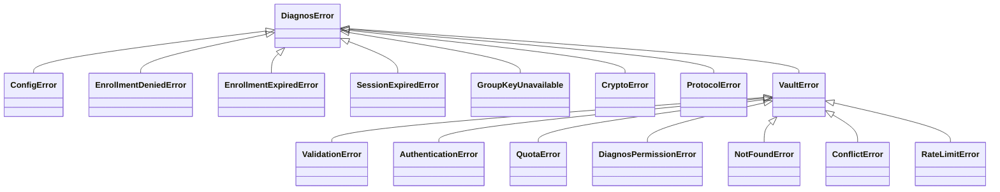

# Erros

[English](errors.md) · **Português (Brasil)**

Toda exceção que o SDK lança pode ser importada de `diagnos`, e cada uma nomeia uma decisão que você precisa tomar:
corrigir a entrada, esperar, refazer o enrollment, pedir a um admin, ou reportar um bug. Capture por classe, nunca por
mensagem — mensagens são para pessoas e podem mudar; classes e `code`s são o contrato. A CLI e a API REST traduzem as
mesmas classes em códigos de saída e status HTTP, então esta página é a tabela única para os três.

## A hierarquia



`VaultError` e as subclasses significam *o cofre respondeu com um erro*; carregam o `code` do cofre, o `status` HTTP,
e o `trace_id` e o `request_id` de que um chamado de suporte precisa. Todo o resto sob `DiagnosError` é decidido
localmente, antes ou depois de falar com o cofre.

## Toda exceção

| Classe | Lançada quando | O que fazer | Saída da CLI | Status da API |
|---|---|---|---|---|
| `ConfigError` | `DIAGNOS_API_TOKEN` ausente ou malformado; uma variável de ambiente inválida; OpenBao configurado sem o extra `openbao` | corrija a configuração | `2` | sai com `2` na subida |
| `EnrollmentDeniedError` | um admin negou o enrollment | nada a retentar — pergunte o motivo | `3` | a subida falha |
| `EnrollmentExpiredError` | ninguém aprovou antes de `expires_at` | rode de novo para um link e um código novos | `3` | a subida falha |
| `SessionExpiredError` | uma chamada assinada sem sessão viva | `unlock()` de novo (as chamadas de recurso fazem isso por você) | `3` | `401` `session_expired` |
| `GroupKeyUnavailable` | o security group do dado não foi concedido a este enrollment | um enrollment novo que o inclua | `3` | `403` `group_key_unavailable` |
| `CryptoError` | um envelope não abriu: chave errada ou bytes adulterados, indistinguíveis de propósito | não retente; reporte | `1` | `500` `crypto_error` |
| `ProtocolError` | o cofre respondeu algo que o protocolo não permite | não retente; reporte com a versão do SDK, ou atualize | `1` | `502` `protocol_error` |
| `ValidationError` | o cofre recusou a requisição como inválida (400, 413) | corrija a entrada | `1` | `400` |
| `AuthenticationError` | token, sessão ou assinatura recusados (401) | em geral, refaça o enrollment | `3` | `401` |
| `QuotaError` | o workspace não tem crédito para isto (402); nada foi feito | compre crédito, ou espere o orçamento | `5` | `402` |
| `DiagnosPermissionError` | esta service account não pode fazer isto aqui (403), inclusive um token revogado | peça a um admin | `3` | `403` |
| `NotFoundError` | documento, versão ou arquivo inexistente (404) | confira o id | `4` | `404` |
| `ConflictError` | uma versão pendente ou mais nova, um replay, ou um upload que não chegou ao armazenamento (409) | leia de novo e combine, ou suba de novo | `7` | `409` |
| `RateLimitError` | ainda com limite de taxa depois do backoff do próprio SDK (429) | vá mais devagar; tente depois | `6` | `429` |
| `VaultError` | qualquer outro erro do cofre — um 5xx depois de uma retentativa, ou uma resposta que não era JSON (`InvalidResponse`) | tente depois; reporte com o `trace_id` se persistir | `1` | `502` |

Qual `code` do cofre vira qual classe — `DocumentVersionMismatch`, `QuotaExceeded`, `ServiceAccountRevoked` e o resto
— é normativo, e mora no [PROTOCOL.pt-BR.md §12](../PROTOCOL.pt-BR.md#12-erros).

Três falhas não são `DiagnosError`s, porque são erros de programação pegos antes de qualquer coisa ser enviada:

| Exceção | Quando |
|---|---|
| `pydantic.ValidationError` | um registro com um campo digitado errado ou inválido — veja [Pacientes](patients.pt-BR.md#erros-de-digitação-são-recusados-campos-desconhecidos-são-mantidos) |
| `TypeError` | `security_group` passado como lista — um documento pertence a exatamente um grupo |
| `ValueError` | um `datetime` sem fuso, uma data ilegível, um upload de `bytes` sem `name` |

`MemoryLockWarning` é um aviso, não um erro: o SO recusou travar uma chave na RAM, e o processo segue com toda outra
proteção. `DIAGNOS_MEMORY_LOCK=require` o transforma numa falha dura — veja
[Configuração](configuration.pt-BR.md#memória-e-hardening-do-processo).

## O que o SDK já retenta

Antes de envolver uma chamada num laço de retentativa: o SDK já retenta tudo que é seguro retentar, com uma
assinatura nova a cada vez, e só lança quando retentar deixou de fazer sentido.

| Condição | O que o SDK faz | Depois lança |
|---|---|---|
| a primeira requisição assinada de um processo | sincroniza o relógio com `GET /time` (mediana de três) | — |
| `401 SignatureTimestampSkew` | ressincroniza o relógio, retenta uma vez | `AuthenticationError` |
| `409 ReplayDetected` | retenta uma vez com um nonce novo | `ConflictError` |
| `429` | espera o `Retry-After` se veio, senão 0,5 s, 1 s, 2 s com jitter — três retentativas | `RateLimitError` |
| qualquer `5xx` | uma retentativa depois de 1 s | `VaultError` |
| `409 DocumentVersionPending` numa gravação | outro escritor segura o slot: retenta depois de 1,5 s e 3 s | `ConflictError` |
| um commit perdido na rede ou para um `5xx` | repete depois de 0,5 s e 1 s — commits são idempotentes | `VaultError` |
| um upload multipart que falha no meio | aborta, para o cofre liberar o espaço | o erro original |

O que sobra para você: `ConflictError` com `DocumentVersionMismatch` significa *alguém salvou no meio-tempo* — leia
de novo, combine, grave de novo ([exemplo](patients.pt-BR.md#gravações-concorrentes-seguras)). `ConflictError` com
`UploadIncomplete` significa que os bytes de um arquivo nunca chegaram ao armazenamento — suba aquele arquivo de novo.
`RateLimitError` e `VaultError` valem mais uma tentativa depois de uma pausa maior.

## Diferença de relógio

Toda requisição assinada carrega um horário que o cofre só aceita dentro de ±120 segundos do próprio relógio. Um
notebook com relógio errado ou um container sem NTP assinaria toda requisição rumo a uma recusa, então o SDK mede a
diferença contra o cofre antes da primeira chamada assinada e a aplica a toda assinatura, e ressincroniza uma vez se
o cofre ainda reclamar. Você não configura nada disso.

> [!NOTE]
> A diferença corrige só as assinaturas. A expiração da sessão é julgada pelo relógio local, então um relógio horas
> fora faz as sessões parecerem expiradas cedo ou tarde demais. Mantenha o NTP rodando em tudo que guarda uma sessão.

## Lendo um erro

```python
from diagnos import Diagnos, NotFoundError, VaultError

vault = Diagnos()
try:
    vault.patients.get("pat_nao_existe")
except NotFoundError as error:
    print(error.code, error.status)  # DocumentNotFound 404
except VaultError as error:
    print("erro do cofre", error.code, error.status, error.trace_id, error.request_id)
```

Logue `code`, `status`, `trace_id` e `request_id` — nunca o registro que você estava gravando. O `trace_id` é o que o
suporte do diagnos precisa para achar o evento do lado do cofre.

## Na CLI e na API REST

A CLI imprime em `stderr` um rótulo bilíngue de uma linha e a mensagem, e sai com o código da tabela acima — `0` no
sucesso. Decida pelo código de saída em scripts; nunca faça grep no texto:

```sh
diagnos --quiet patients get "$PATIENT_ID" > patient.txt
case $? in
  0) echo "ok" ;;
  3) echo "refaça o enrollment, ou peça acesso a um admin" ;;
  4) echo "paciente inexistente" ;;
  *) echo "falhou" ;;
esac
```

A API REST responde todo não-2xx com um envelope só, cujo `code` é o do próprio cofre quando a falha veio do cofre:

```json
{ "error": { "code": "DocumentNotFound", "message": "…", "trace_id": "…" } }
```

Além dos status da tabela, ela responde `422` (`invalid_request`) para um corpo ou query que falha na validação,
`401` (`client_certificate_required`) e `403` (`client_certificate_cn_not_allowed`) para falhas de TLS mútuo, e
`404`/`405` para rota ou método desconhecidos — sempre no mesmo envelope. A [referência da
API](../reference/openapi.json) os documenta por rota.
