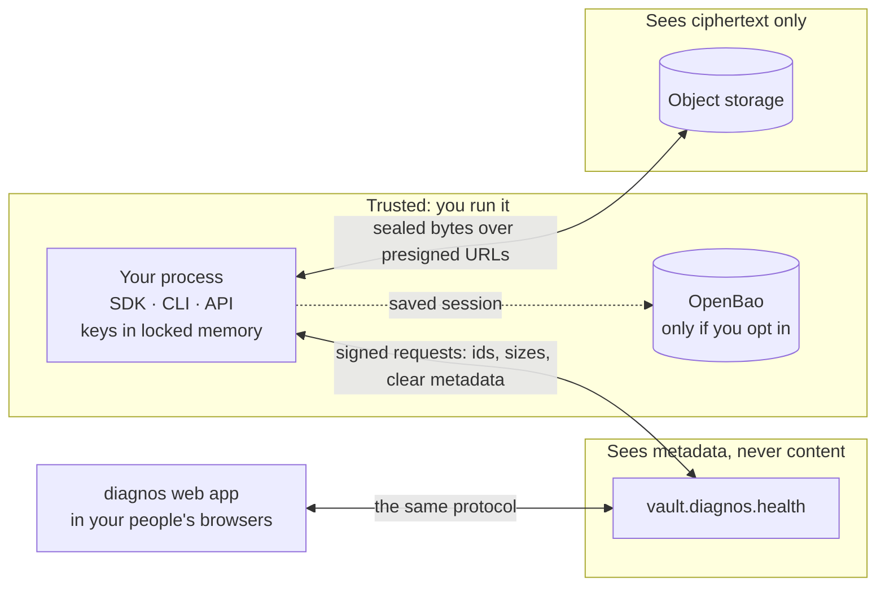

# Security model

**English** · [Português (Brasil)](security.pt-BR.md)

What diagnos protects, from whom, and where the protection ends. The short version: clinical content is encrypted
and decrypted only in processes you run, the vault stores ciphertext and the metadata it needs to route and
authorize, and every key your process holds lives in locked memory that never becomes a Python object. To report a
vulnerability, follow [SECURITY.md](../../SECURITY.md) — never a public issue.

## Trust boundaries

Your process and the web app are the only places plaintext exists. The vault is trusted to route, authorize, bill
and keep history — not to read. Object storage is trusted with nothing but availability.

## What the vault sees

| The vault sees | The vault never sees |
|---|---|
| the service account behind each request, and the runtime it described at enrollment (OS, hostname, user, container, cloud) | the content of any record — names, birth dates, addresses, notes, reports |
| document ids, their security group, resource type, version ids, sizes, timestamps and who created each | the sealed summaries — names, tags, external ids, exam titles and modalities |
| clear metadata: an exam's `patient_id`, a patient's `specialist_ids`, `report_status`, the archived and deleted flags | file names and file contents |
| file node ids, their group, exam and folder, MIME type, sizes, status and timestamps | group keys, document keys, file keys, and your process's private keys |
| wrapped keys it cannot unwrap, and which ids you read and write, when | anything your process decrypts |

Two nuances matter. **Identity documents** (`identifiers`, such as a CPF) are sealed by the vault's own
sensitive-data route, so the vault *can* open them — each opening is audited, and the SDK never writes a new one.
**Session keys** are shared with the vault by design: they sign requests and seal the entropy the vault contributes;
they never encrypt data.

Object storage receives, per file, a server-side encryption key derived from the file's own key (SSE-C) — a second
layer the web app uses too. It is defense in depth, not the protection: beneath it the bytes are already end-to-end
encrypted.

## What your process protects

- **Keys never become Python objects.** Session keys, group and document keys and the enrollment key pair live in a
  Rust enclave: locked in RAM (never swapped), fenced by guard pages, excluded from core dumps, wiped in a `fork()`
  child and zeroed the moment they are dropped. Signing, sealing and opening all happen inside it.
  [The enclave](../../apps/sdk/native/README.md) lists every mechanism.
- **The process hardens itself at unlock**: core dumps off and debugger attach denied, the moment it starts holding
  clinical keys.
- **Enrollment is post-quantum.** Keys reach the process sealed with X25519 plus ML-KEM-768, so a recording of the
  enrollment stays safe against a future quantum adversary.
- **Every request is signed** — HMAC-SHA512 over the method, path, query, a timestamp, a single-use nonce and the
  body — so a request cannot be altered or replayed.
- **Every ciphertext is authenticated.** A wrong key and a tampered byte raise the same `CryptoError`, deliberately:
  distinguishing them would hand an oracle to whoever is probing.
- **Nothing sensitive is printed.** Every `repr` of a token, settings object, key or client is redacted, and the REST
  API never logs a request body or a file name.
- **Randomness cannot be weakened from outside.** The vault contributes a fresh seed with every response, mixed into
  the operating system's randomness — never replacing it — so even an all-zero seed leaves ordinary OS randomness.

## What it does not protect against

- **Root, or `CAP_SYS_PTRACE`, on the host.** Kernel-level access reads any page; the enclave narrows the attack
  surface to that, it is not a hardware enclave.
- **Code running inside the same process.** A malicious dependency shares the address space. What it cannot do is find
  a key by walking the Python heap.
- **What you do with plaintext.** Decrypted records and file bytes are returned to your code; logging them, writing
  them to disk or sending them elsewhere is outside the SDK's reach. (Uploading a stream that is not a path or `bytes`
  copies it to a temporary file first — see [Files](files.md#upload).)
- **An admin approving the wrong enrollment.** Approval is the security model; an admin who approves a runtime they
  do not recognize grants it real access.
- **Metadata and access patterns.** The vault sees what the left column above lists, including which documents you
  touch and when.
- **Windows' weaker primitives.** Locked memory and zero-on-drop only: no guard pages, no fork semantics, no dump
  exclusion. `memory_status()` says so on the machine itself.

## Choices that change the model

| Choice | What changes |
|---|---|
| [OpenBao auto-unseal](sessions.md#the-trade-off) | group keys also live in OpenBao: whoever reads that path decrypts what the process can |
| `DIAGNOS_MEMORY_LOCK=best-effort` (the default) | if the OS refuses to lock memory, keys may reach swap; you get one `MemoryLockWarning` — `require` refuses to run instead |
| `DIAGNOS_HARDEN_PROCESS=0` | core dumps and debuggers can read keys from the process |
| running the REST API | plaintext crosses your network between callers and the API, inside mutual TLS — see below |

## The REST API's boundary

`diagnos-api` holds one session and serves it to every caller with a valid client certificate, so **the client CA is
the access control**: any system holding a certificate it signed reads everything the API's enrollment can. Issue
one certificate per calling system, restrict names with `DIAGNOS_API_ALLOWED_CLIENT_CN`, keep the CA's private key
offline, and treat the API process as part of the trusted zone above. Lists are anonymous unless a caller asks for
`?summary=true`. The [REST API guide](api.md#why-mutual-tls) explains why nothing but mutual TLS is accepted.
