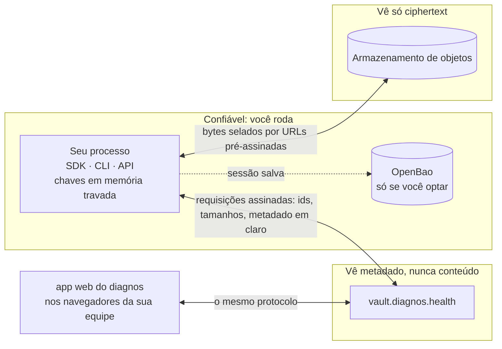

# Modelo de segurança

[English](security.md) · **Português (Brasil)**

O que o diagnos protege, de quem, e onde a proteção termina. A versão curta: conteúdo clínico é cifrado e decifrado
só em processos que você roda, o cofre guarda ciphertext e o metadado de que precisa para rotear e autorizar, e toda
chave que o seu processo guarda vive em memória travada que nunca vira um objeto Python. Para reportar uma
vulnerabilidade, siga o [SECURITY.pt-BR.md](../../SECURITY.pt-BR.md) — nunca uma issue pública.

## Fronteiras de confiança

O seu processo e o app web são os únicos lugares em que existe texto claro. O cofre é confiável para rotear,
autorizar, cobrar e guardar histórico — não para ler. O armazenamento de objetos é confiável para nada além de
disponibilidade.

## O que o cofre vê

| O cofre vê | O cofre nunca vê |
|---|---|
| a service account por trás de cada requisição, e o runtime que ela descreveu no enrollment (SO, hostname, usuário, container, cloud) | o conteúdo de nenhum registro — nomes, datas de nascimento, endereços, notas, laudos |
| ids de documento, o security group, o tipo de recurso, ids de versão, tamanhos, horários e quem criou cada uma | os resumos selados — nomes, tags, ids externos, títulos e modalidades de exame |
| metadado em claro: o `patient_id` de um exame, os `specialist_ids` de um paciente, `report_status`, as flags de arquivado e apagado | nomes e conteúdo de arquivo |
| ids de nó de arquivo, o grupo, exame e pasta, tipo MIME, tamanhos, status e horários | chaves de grupo, de documento, de arquivo, e as chaves privadas do seu processo |
| chaves embrulhadas que ele não consegue desembrulhar, e quais ids você lê e grava, quando | nada do que o seu processo decifra |

Duas nuances importam. **Documentos de identidade** (`identifiers`, como um CPF) são selados pela rota de dado
sensível do próprio cofre, então o cofre *consegue* abri-los — cada abertura é auditada, e o SDK nunca grava um novo.
**Chaves de sessão** são compartilhadas com o cofre por desenho: assinam requisições e selam a entropia com que o
cofre contribui; nunca cifram dado.

O armazenamento de objetos recebe, por arquivo, uma chave de cifragem do lado do servidor derivada da chave do próprio
arquivo (SSE-C) — uma segunda camada que o app web também usa. É defesa em profundidade, não a proteção: por baixo
dela os bytes já estão cifrados ponta a ponta.

## O que o seu processo protege

- **Chaves nunca viram objetos Python.** Chaves de sessão, de grupo e de documento e o par de chaves do enrollment
  vivem num enclave Rust: travadas na RAM (nunca vão para o swap), cercadas por guard pages, fora de core dumps,
  zeradas num filho de `fork()` e zeradas no instante em que são descartadas. Assinar, selar e abrir acontecem todos
  lá dentro. [O enclave](../../apps/sdk/native/README.pt-BR.md) lista todo mecanismo.
- **O processo se endurece no unlock**: core dumps desligados e attach de debugger negado, no instante em que começa
  a guardar chaves clínicas.
- **O enrollment é pós-quântico.** As chaves chegam ao processo seladas com X25519 mais ML-KEM-768, então uma gravação
  do enrollment continua segura contra um adversário quântico no futuro.
- **Toda requisição é assinada** — HMAC-SHA512 sobre o método, o path, a query, um horário, um nonce de uso único e o
  corpo — então uma requisição não pode ser alterada nem repetida.
- **Todo ciphertext é autenticado.** Uma chave errada e um byte adulterado lançam o mesmo `CryptoError`, de propósito:
  distingui-los daria um oráculo a quem estiver sondando.
- **Nada sensível é impresso.** Todo `repr` de token, objeto de configuração, chave ou cliente é redigido, e a API
  REST nunca loga um corpo de requisição ou um nome de arquivo.
- **A aleatoriedade não pode ser enfraquecida de fora.** O cofre contribui com uma semente nova a cada resposta,
  misturada à aleatoriedade do sistema operacional — nunca a substituindo — então mesmo uma semente toda de zeros deixa
  a aleatoriedade comum do SO.

## Contra o que não protege

- **Root, ou `CAP_SYS_PTRACE`, no host.** Acesso no nível do kernel lê qualquer página; o enclave estreita a superfície
  de ataque até isso, não é um enclave de hardware.
- **Código rodando dentro do mesmo processo.** Uma dependência maliciosa divide o espaço de endereçamento. O que ela
  não consegue é achar uma chave percorrendo o heap do Python.
- **O que você faz com o texto claro.** Registros e bytes de arquivo decifrados são devolvidos ao seu código; logá-los,
  gravá-los em disco ou mandá-los a outro lugar está fora do alcance do SDK. (Subir um stream que não é path nem
  `bytes` o copia antes para um arquivo temporário — veja [Arquivos](files.pt-BR.md#subir).)
- **Um admin aprovando o enrollment errado.** A aprovação é o modelo de segurança; um admin que aprova um runtime que
  não reconhece concede a ele acesso de verdade.
- **Metadado e padrões de acesso.** O cofre vê o que a coluna da esquerda acima lista, inclusive quais documentos você
  toca e quando.
- **As primitivas mais fracas do Windows.** Só memória travada e zerar ao descartar: sem guard pages, sem semântica de
  fork, sem exclusão de dump. O `memory_status()` diz isso na própria máquina.

## Escolhas que mudam o modelo

| Escolha | O que muda |
|---|---|
| [auto-unseal com OpenBao](sessions.pt-BR.md#a-troca) | as chaves de grupo também moram no OpenBao: quem lê aquele path decifra o que o processo decifra |
| `DIAGNOS_MEMORY_LOCK=best-effort` (o padrão) | se o SO recusa travar memória, chaves podem ir para o swap; você recebe um `MemoryLockWarning` — `require` se recusa a rodar |
| `DIAGNOS_HARDEN_PROCESS=0` | core dumps e debuggers conseguem ler chaves do processo |
| rodar a API REST | texto claro atravessa a sua rede entre quem chama e a API, dentro do TLS mútuo — veja abaixo |

## A fronteira da API REST

O `diagnos-api` mantém uma sessão e a serve a todo chamador com um certificado de cliente válido, então **a CA de
clientes é o controle de acesso**: qualquer sistema com um certificado que ela assinou lê tudo que o enrollment da API
lê. Emita um certificado por sistema chamador, restrinja nomes com `DIAGNOS_API_ALLOWED_CLIENT_CN`, mantenha a chave
privada da CA offline, e trate o processo da API como parte da zona confiável acima. As listas são anônimas a menos
que quem chama peça `?summary=true`. O [guia da API REST](api.pt-BR.md#por-que-tls-mútuo) explica por que nada além de
TLS mútuo é aceito.
