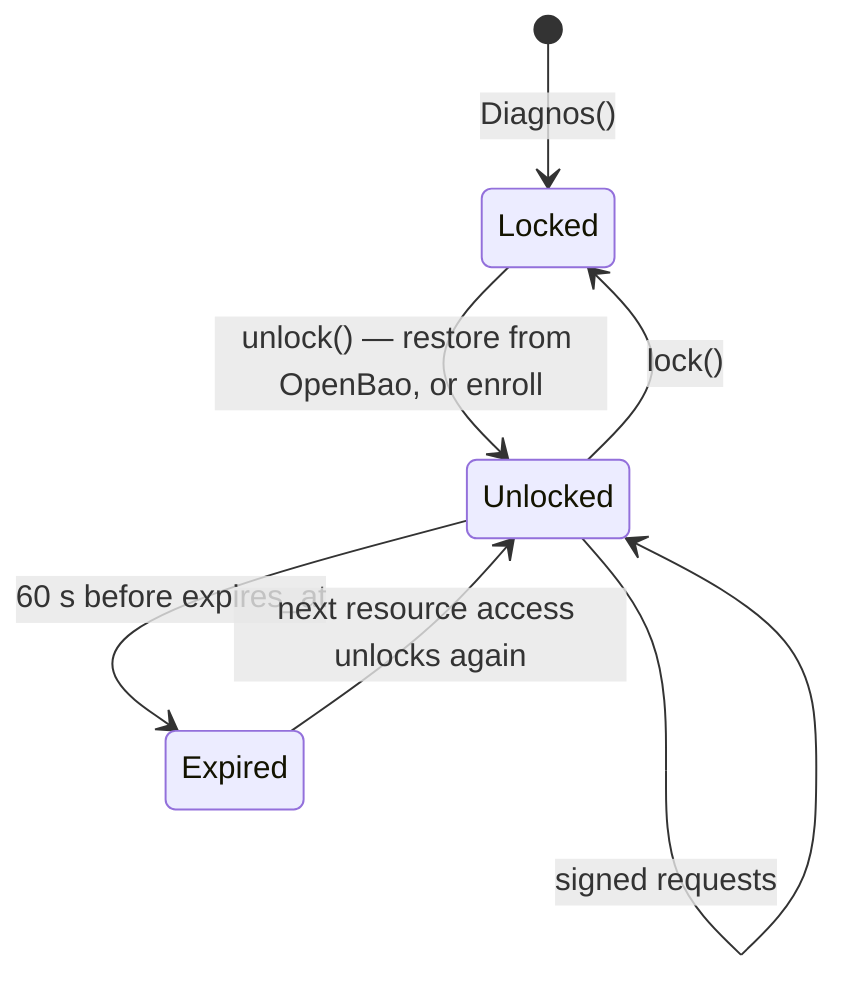
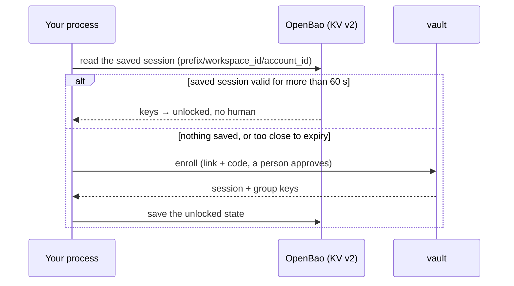

# Sessions

**English** · [Português (Brasil)](sessions.pt-BR.md)

A session is what an approved [enrollment](authentication.md#enrollment) leaves in your process: a session id, the
two keys that sign and protect its requests, and the key of every security group it was granted — all of it in
locked memory, valid until the vault's `expires_at`. This page is about its life: when it starts, how it ends, and
how a server keeps one across restarts without a person approving each time.

## The lifecycle



- **`Diagnos()`** only parses the token. It makes no request and holds no key.
- **`unlock()`** restores a saved session from OpenBao when one is configured and still valid, and enrolls
  otherwise. It is idempotent, and you rarely call it: `with Diagnos() as vault:` unlocks on entry, and the first
  touch of `vault.patients`, `vault.exams` or `vault.drives` unlocks lazily.
- **Unlocking hardens the process** first — core dumps off, debugger attach denied — because this is the moment it
  starts holding clinical keys. [The enclave](../../apps/sdk/native/README.md) lists exactly what that does.

```python
from diagnos import Diagnos

vault = Diagnos()
print(vault.security_groups)  # [] — nothing unlocked yet
vault.patients.list()  # unlocks on first use
print(vault.security_groups)  # the granted groups
```

## Closing is not locking

Leaving a `with` block — or calling `close()` — closes the HTTP connections and nothing else. The session stays
valid, so a worker with OpenBao auto-unseal that restarts a minute later restores the very same session instead of
asking a person again. Ending a session is a separate, explicit act:

```python
from diagnos import Diagnos

with Diagnos() as vault:
    vault.patients.list()
    vault.lock()  # ends the session on the vault, deletes the OpenBao copy, wipes every key in this process
```

`lock()` is best-effort towards the vault — a network error or an already-expired session does not stop it — and
unconditional locally: every key is zeroed whether or not the vault answered.

## Expiry

The vault sets `expires_at` when it approves an enrollment. The SDK treats a session as over **60 seconds early**, so
no request starts signing with a session that could expire mid-flight. What happens next depends on how you reach
the vault:

| You call | With an expired session |
|---|---|
| `vault.patients` / `vault.exams` / `vault.drives` | unlocks again — restores from OpenBao, or enrolls and prompts |
| `unlock()` | the same |
| a signed request with no live session at all | `SessionExpiredError` |

> [!NOTE]
> A long-running process without OpenBao therefore **prompts again** when its session expires, and blocks until
> someone approves. If nobody will be there to approve, configure [auto-unseal](#auto-unseal-with-openbao).

## One process, one session

A session is never written to disk (unless you opt into OpenBao) and never shared between processes:

- **Every process enrolls on its own.** Two workers are two enrollments; each CLI invocation is its own process.
- **Threads share one `Diagnos`.** Unlock it once before handing it to worker threads — the REST API does exactly
  that at startup — so two threads never race to enroll.
- **A `fork()` child starts empty.** Key pages are wiped in a forked child, and using one raises. With `gunicorn`,
  `multiprocessing` or Celery prefork, build the `Diagnos` inside each worker, after the fork.

## Auto-unseal with OpenBao

A human approval on every restart is fine for a laptop script; it is not fine for a Kubernetes pod or a cron job.
With [OpenBao](https://openbao.org/) configured, the SDK saves its unlocked state right after a successful enrollment
and restores it on the next start — no human, until the saved session itself expires.



### Turning it on

```sh
pip install "diagnos[openbao]"
export OPENBAO_ADDR="https://openbao.internal:8200"
export OPENBAO_TOKEN="…"            # or OPENBAO_TOKEN_FILE=/run/secrets/openbao-token
```

Auto-unseal is on exactly when `OPENBAO_ADDR` is set. `auto_unseal=` overrides that for one client, and the CLI's
`login --auto-unseal/--no-auto-unseal` does the same for one invocation:

```python
from diagnos import Diagnos

vault = Diagnos()  # auto-unseal is on exactly when OPENBAO_ADDR is set
local_only = Diagnos(auto_unseal=False)  # never saves or restores, even when it is
```

`OPENBAO_MOUNT`, `OPENBAO_PATH_PREFIX` and `OPENBAO_NAMESPACE` are in [Configuration](configuration.md#openbao).

### The trade-off

> [!WARNING]
> Auto-unseal moves your group keys from "only ever in this process's locked memory" to "also in OpenBao's storage,
> at `<OPENBAO_PATH_PREFIX>/<workspace_id>/<account_id>`". **Whoever can read that one path can decrypt exactly what
> this process can.** That is the price of restarting without a person; pay it knowingly.

| | Without OpenBao | With OpenBao |
|---|---|---|
| where group keys live | this process's locked RAM | that, plus OpenBao's encrypted KV |
| a restart needs | a person to approve | nothing, until the saved session expires |
| a stolen OpenBao token with read on the path | — | decrypts what this process can |
| keys as Python objects | never | for milliseconds, while saving and restoring |

The last row is the one place keys leave the memory enclave: to be written as JSON, they are revealed into buffers
that are zeroed as soon as the request is built. [The enclave](../../apps/sdk/native/README.md#what-is-not) states
the window precisely.

### Scoping the OpenBao token

Give the process a token that can reach its own path and nothing else. This is the policy the Compose and Kubernetes
bootstraps write (`apps/api/deploy/compose/openbao/policy.hcl`), with the workspace and account ids filled in:

```hcl
path "secret/data/diagnos/<workspace_id>/<account_id>" {
  capabilities = ["create", "update", "read", "delete"]
}
path "secret/metadata/diagnos/<workspace_id>/<account_id>" {
  capabilities = ["create", "update", "read", "delete"]
}
```

`metadata/` is there because `lock()` deletes every saved version, not only the latest. `diagnos status` prints the
two ids straight from the token, without touching the network.

### What is saved, and when it is used

- **Saved** right after every successful enrollment, overwriting the previous one. The exact JSON is in
  [PROTOCOL.md §11](../PROTOCOL.md#11-openbao-auto-unseal).
- **Restored** by `unlock()` only while the saved session has more than 60 seconds left; otherwise the process
  enrolls again and saves the new session.
- **Deleted** by `lock()` — every version of it.

### Choosing

| You run | Use |
|---|---|
| a script on your laptop | no OpenBao: approve each run |
| the CLI from cron | OpenBao, with a token scoped to that service account's path |
| a long-running worker or pod | OpenBao, and one service account per replica |
| the REST API | OpenBao — the [deploy manifests](../../apps/api/deploy/README.md) ship it, with KMS auto-unseal for OpenBao itself |
