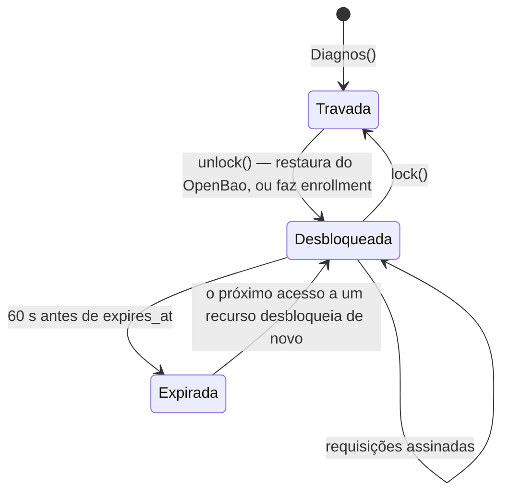
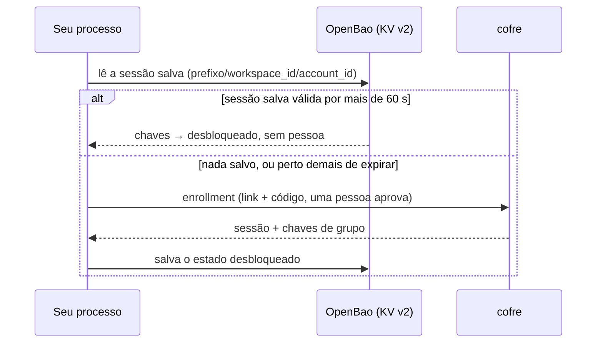

# Sessões

[English](sessions.md) · **Português (Brasil)**

Uma sessão é o que um [enrollment](authentication.pt-BR.md#enrollment) aprovado deixa no seu processo: um id de
sessão, as duas chaves que assinam e protegem as requisições dela e a chave de todo security group concedido — tudo
em memória travada, válido até o `expires_at` do cofre. Esta página é sobre a vida dela: quando começa, como termina
e como um servidor a mantém entre reinícios sem uma pessoa aprovando toda vez.

## O ciclo de vida



- **`Diagnos()`** só lê o token. Não faz requisição nem guarda chave.
- **`unlock()`** restaura uma sessão salva do OpenBao quando há um configurado e ela ainda vale, e faz enrollment
  caso contrário. É idempotente, e você raramente o chama: `with Diagnos() as vault:` desbloqueia na entrada, e o
  primeiro toque em `vault.patients`, `vault.exams` ou `vault.drives` desbloqueia de forma preguiçosa.
- **Desbloquear endurece o processo** antes — core dumps desligados, anexar um debugger negado — porque este é o
  momento em que ele começa a guardar chaves clínicas. [O enclave](../../apps/sdk/native/README.pt-BR.md) lista
  exatamente o que isso faz.

```python
from diagnos import Diagnos

vault = Diagnos()
print(vault.security_groups)  # [] — nada desbloqueado ainda
vault.patients.list()  # desbloqueia no primeiro uso
print(vault.security_groups)  # os grupos concedidos
```

## Fechar não é travar

Sair de um bloco `with` — ou chamar `close()` — fecha as conexões HTTP e nada mais. A sessão continua válida, então
um worker com auto-unseal no OpenBao que reinicia um minuto depois restaura a mesmíssima sessão em vez de pedir a
uma pessoa de novo. Encerrar uma sessão é um ato à parte, explícito:

```python
from diagnos import Diagnos

with Diagnos() as vault:
    vault.patients.list()
    vault.lock()  # encerra a sessão no cofre, apaga a cópia no OpenBao, zera toda chave neste processo
```

`lock()` é best-effort em relação ao cofre — um erro de rede ou uma sessão já expirada não o impedem — e
incondicional localmente: toda chave é zerada tenha o cofre respondido ou não.

## Expiração

O cofre define o `expires_at` quando aprova um enrollment. O SDK considera uma sessão encerrada **60 segundos antes**,
para nenhuma requisição começar a assinar com uma sessão que poderia expirar no meio do caminho. O que acontece depois
depende de como você chega ao cofre:

| Você chama | Com uma sessão expirada |
|---|---|
| `vault.patients` / `vault.exams` / `vault.drives` | desbloqueia de novo — restaura do OpenBao, ou faz enrollment e mostra o prompt |
| `unlock()` | o mesmo |
| uma requisição assinada sem sessão viva nenhuma | `SessionExpiredError` |

> [!NOTE]
> Um processo de longa duração sem OpenBao, portanto, **mostra o prompt de novo** quando a sessão expira, e bloqueia
> até alguém aprovar. Se ninguém vai estar lá para aprovar, configure o [auto-unseal](#auto-unseal-com-openbao).

## Um processo, uma sessão

Uma sessão nunca é gravada em disco (a menos que você opte pelo OpenBao) e nunca é compartilhada entre processos:

- **Todo processo faz o próprio enrollment.** Dois workers são dois enrollments; cada invocação da CLI é um processo
  próprio.
- **Threads compartilham um `Diagnos`.** Desbloqueie-o uma vez antes de entregá-lo às threads — a API REST faz
  exatamente isso na subida — para duas threads nunca disputarem um enrollment.
- **Um filho de `fork()` começa vazio.** As páginas de chave são zeradas num filho de fork, e usar uma lança erro.
  Com `gunicorn`, `multiprocessing` ou Celery em prefork, construa o `Diagnos` dentro de cada worker, depois do fork.

## Auto-unseal com OpenBao

Uma aprovação humana a cada reinício serve para um script no notebook; não serve para um pod do Kubernetes ou um
cron. Com o [OpenBao](https://openbao.org/) configurado, o SDK salva o estado desbloqueado logo depois de um
enrollment bem-sucedido e o restaura na subida seguinte — sem pessoa nenhuma, até a própria sessão salva expirar.



### Ligando

```sh
pip install "diagnos[openbao]"
export OPENBAO_ADDR="https://openbao.internal:8200"
export OPENBAO_TOKEN="…"            # ou OPENBAO_TOKEN_FILE=/run/secrets/openbao-token
```

O auto-unseal está ligado exatamente quando `OPENBAO_ADDR` está definida. `auto_unseal=` sobrescreve isso para um
cliente, e o `login --auto-unseal/--no-auto-unseal` da CLI faz o mesmo para uma invocação:

```python
from diagnos import Diagnos

vault = Diagnos()  # o auto-unseal está ligado exatamente quando OPENBAO_ADDR está definida
local_only = Diagnos(auto_unseal=False)  # nunca salva nem restaura, mesmo quando está
```

`OPENBAO_MOUNT`, `OPENBAO_PATH_PREFIX` e `OPENBAO_NAMESPACE` estão em [Configuração](configuration.pt-BR.md#openbao).

### A troca

> [!WARNING]
> O auto-unseal leva as suas chaves de grupo de "só na memória travada deste processo" para "também no armazenamento
> do OpenBao, em `<OPENBAO_PATH_PREFIX>/<workspace_id>/<account_id>`". **Quem consegue ler esse único path decifra
> exatamente o que este processo decifra.** É o preço de reiniciar sem uma pessoa; pague sabendo.

| | Sem OpenBao | Com OpenBao |
|---|---|---|
| onde as chaves de grupo moram | a RAM travada deste processo | isso, mais o KV cifrado do OpenBao |
| um reinício precisa de | uma pessoa para aprovar | nada, até a sessão salva expirar |
| um token do OpenBao roubado com leitura no path | — | decifra o que este processo decifra |
| chaves como objetos Python | nunca | por milissegundos, ao salvar e restaurar |

A última linha é o único lugar em que chaves saem do enclave de memória: para serem gravadas como JSON, elas são
reveladas em buffers que são zerados assim que a requisição é montada. [O
enclave](../../apps/sdk/native/README.pt-BR.md#o-que-não-é) descreve a janela com precisão.

### Restringindo o token do OpenBao

Dê ao processo um token que alcance o próprio path e nada mais. Esta é a política que os bootstraps do Compose e do
Kubernetes gravam (`apps/api/deploy/compose/openbao/policy.hcl`), com os ids de workspace e de conta preenchidos:

```hcl
path "secret/data/diagnos/<workspace_id>/<account_id>" {
  capabilities = ["create", "update", "read", "delete"]
}
path "secret/metadata/diagnos/<workspace_id>/<account_id>" {
  capabilities = ["create", "update", "read", "delete"]
}
```

O `metadata/` está lá porque `lock()` apaga toda versão salva, não só a última. `diagnos status` imprime os dois ids
direto do token, sem tocar a rede.

### O que é salvo, e quando é usado

- **Salvo** logo depois de todo enrollment bem-sucedido, sobrescrevendo o anterior. O JSON exato está no
  [PROTOCOL.pt-BR.md §11](../PROTOCOL.pt-BR.md#11-auto-unseal-com-openbao).
- **Restaurado** pelo `unlock()` só enquanto a sessão salva tem mais de 60 segundos pela frente; senão o processo faz
  enrollment de novo e salva a sessão nova.
- **Apagado** pelo `lock()` — toda versão dele.

### Escolhendo

| Você roda | Use |
|---|---|
| um script no seu notebook | sem OpenBao: aprove cada execução |
| a CLI a partir do cron | OpenBao, com um token restrito ao path daquela service account |
| um worker ou pod de longa duração | OpenBao, e uma service account por réplica |
| a API REST | OpenBao — os [manifestos de deploy](../../apps/api/deploy/README.pt-BR.md) já o trazem, com auto-unseal por KMS para o próprio OpenBao |
